```{=latex}
\begin{titlepage}
\begin{center}

\vspace*{-2cm}

\begin{tikzpicture}[remember picture, overlay]
  \draw[line width=2pt]
    ($(current page.north west) + (1.5cm,-1.5cm)$)
    rectangle
    ($(current page.south east) + (-1.3cm,1.3cm)$);
\end{tikzpicture}


\noindent
\begin{minipage}{0.3\textwidth}
\IfFileExists{images/logo_final.png}{
  \includegraphics[width=\linewidth]{images/logo_final.png}
}{
  \textbf{[Logo bị thiếu]}
}

\end{minipage}
\hfill
\begin{minipage}{0.65\textwidth}
\centering
{\Large \textbf{BỘ GIÁO DỤC VÀ ĐÀO TẠO}\\[0.2cm]}
{\Large \textbf{TRƯỜNG ĐẠI HỌC CÔNG NGHỆ TP.HCM}}
\end{minipage}

\vfill 


\begin{center}

\textbf{\LARGE ĐỒ ÁN CƠ SỞ}\\[5cm]

\textbf{\LARGE \uppercase{CHIẾN LƯỢC PHÂN KHÚC KHÁCH HÀNG HIỆU QUẢ}}\\[-1.5cm]
\textbf{\LARGE \uppercase{ỨNG DỤNG K-MEANS VÀ RFM:}}\\[4.5cm]

{\Large
\begin{flushleft}
{Ngành:} \textbf{KHOA HỌC DỮ LIỆU}\\[0.2cm]
{Chuyên ngành:} \textbf{KHOA HỌC DỮ LIỆU}\\[0.2cm]
{Giảng viên hướng dẫn:} \textbf{ThS.NGUYỄN QUANG PHÚC}\\[0.2cm]
{Nhóm sinh viên thực hiện:}\\[0.2cm]
\end{flushleft}
}

\vspace{0.3cm}
{\Large
\begin{tabular}{ll}
Nguyễn Nhật Nam      & MSSV: 2286400019 \\[0.2cm]
Hoàng Quang Minh     & MSSV: 2286400017 \\[0.2cm]
Hà Thế Anh           & MSSV: 2286400002 \\[0.2cm]
\end{tabular}
}
\vspace{0.5cm}

{\Large \textbf{Lớp:} \textbf{22DKHA1}}

\end{center}

\vfill


\begin{center}
{\Large TP. Hồ Chí Minh, 2025}
\end{center}

\end{center}
\end{titlepage}
```

```{=latex}
\begin{titlepage}
\begin{center}

\vspace*{-2cm}

\begin{tikzpicture}[remember picture, overlay]
  \draw[line width=2pt]
    ($(current page.north west) + (1.5cm,-1.5cm)$)
    rectangle
    ($(current page.south east) + (-1.3cm,1.3cm)$);
\end{tikzpicture}


\noindent
\begin{minipage}{0.3\textwidth}
\IfFileExists{images/logo_final.png}{
  \includegraphics[width=\linewidth]{images/logo_final.png}
}{
  \textbf{[Logo bị thiếu]}
}

\end{minipage}
\hfill
\begin{minipage}{0.65\textwidth}
\centering
{\Large \textbf{BỘ GIÁO DỤC VÀ ĐÀO TẠO}\\[0.2cm]}
{\Large \textbf{TRƯỜNG ĐẠI HỌC CÔNG NGHỆ TP.HCM}}
\end{minipage}

\vfill 


\begin{center}

\textbf{\LARGE ĐỒ ÁN CƠ SỞ}\\[5cm]

\textbf{\LARGE \uppercase{CHIẾN LƯỢC PHÂN KHÚC KHÁCH HÀNG HIỆU QUẢ}}\\[-1.5cm]
\textbf{\LARGE \uppercase{ỨNG DỤNG K-MEANS VÀ RFM:}}\\[4.5cm]

{\Large
\begin{flushleft}
{Ngành:} \textbf{KHOA HỌC DỮ LIỆU}\\[0.2cm]
{Chuyên ngành:} \textbf{KHOA HỌC DỮ LIỆU}\\[0.2cm]
{Giảng viên hướng dẫn:} \textbf{ThS.NGUYỄN QUANG PHÚC}\\[0.2cm]
{Sinh viên thực hiện:}\\[0.2cm]
\end{flushleft}
}

\vspace{0.3cm}
{\Large
\begin{tabular}{ll}
Nguyễn Nhật Nam      & MSSV: 2286400019 \\[0.2cm]
Hoàng Quang Minh     & MSSV: 2286400017 \\[0.2cm]
Hà Thế Anh           & MSSV: 2286400002 \\[0.2cm]
\end{tabular}
}
\vspace{0.5cm}

{\Large \textbf{Lớp:} \textbf{22DKHA1}}

\end{center}

\vfill


\begin{center}
{\Large TP. Hồ Chí Minh, 2025}
\end{center}

\end{center}
\end{titlepage}
```

\newpage
\thispagestyle{empty}
\begin{center}
    \textbf{\LARGE NHẬN XÉT CỦA GIẢNG VIÊN HƯỚNG DẪN}
\end{center}

\vspace{1cm}

\noindent
\dotfill

\vspace{0.5cm}
\noindent
\dotfill

\vspace{0.5cm}
\noindent
\dotfill

\vspace{0.5cm}
\noindent
\dotfill

\vspace{0.5cm}
\noindent
\dotfill

\vspace{0.5cm}
\noindent
\dotfill

\vspace{0.5cm}
\noindent
\dotfill

\vspace{0.5cm}
\noindent
\dotfill

\vspace{0.5cm}
\noindent
\dotfill

\vspace{0.5cm}
\noindent
\dotfill

\vspace{1.5cm}

\begin{flushright}
    TP.HCM, Ngày\ldots\ tháng\ldots\ năm 2025\\[0.4cm]
    \textbf{Giảng viên hướng dẫn}\\[0.4cm]
    (Ký tên, đóng dấu)
\end{flushright}
\newpage


\newpage

\section*{LỜI CAM ĐOAN}

Chúng tôi, Hoàng Quang Minh, Nguyễn Nhật Nam và Hà Thế Anh xin cam đoan rằng:

Mọi thông tin và nghiên cứu được trình bày trong bài báo cáo này là trung thực và khách quan được thu thập và phân tích một cách cẩn thận dựa trên các nguồn chính thống và đáng tin cậy.

Bất kỳ thông tin hoặc ý kiến nào được trích dẫn từ các nguồn khác đều được nêu rõ nguồn gốc và được trích dẫn theo đúng quy định. Chúng tôi xin cam đoan rằng không có bất kỳ sự sao chép hoặc sử dụng thông tin không đúng đắn nào từ các nguồn khác.

Bài báo cáo này là công trình nghiên cứu độc lập của chúng tôi chưa từng được công bố ở bất kỳ nơi nào khác. Tôi cam đoan rằng đã tuân thủ đầy đủ các quy tắc và quy định của môn học bao gồm cả việc tham khảo và sử dụng công cụ nghiên cứu.

Tôi hy vọng rằng bài báo cáo này sẽ cung cấp một cái nhìn tổng quan rõ ràng và toàn diện về chủ đề “Ứng dụng K-Means và RFM: Chiến lược phân khúc khách hàng hiệu quả" và sẽ đóng góp một phần nhỏ vào lĩnh vực nghiên cứu này.

\vspace{1.5cm}

\begin{flushright}
TP. Hồ Chí Minh, Ngày\ldots\ tháng\ldots\ năm 2025\\[0.3cm]
Sinh viên\\[0.8cm]
Hoàng Quang Minh\\
Nguyễn Nhật Nam\\
Hà Thế Anh
\end{flushright}


\newpage
\tableofcontents
\newpage


\newpage
\begin{center}
    \textbf{\LARGE DANH MỤC CÁC KÝ HIỆU, CHỮ VIẾT TẮT VÀ TỪ KHÓA}
\end{center}
\addcontentsline{toc}{section}{Danh mục các ký hiệu, chữ viết tắt và từ khóa}

\vspace{1cm}

\subsection*{1. Ký hiệu và chữ viết tắt}
\begin{itemize}
  \item \textbf{RFM}: Recency - Frequency - Monetary (Thời gian gần nhất - Tần suất - Giá trị chi tiêu)
  \item \textbf{K-Means}: Thuật toán phân cụm K-Means
  \item \textbf{PCA}: Principal Component Analysis - Phân tích thành phần chính
  \item \textbf{t-SNE}: t-distributed Stochastic Neighbor Embedding - Phép nhúng lân cận xác suất
  \item \textbf{UMAP}: Uniform Manifold Approximation and Projection - Xấp xỉ và chiếu theo đa tạp
  \item \textbf{WCSS}: Within-Cluster Sum of Squares - Tổng phương sai trong cụm
  \item \textbf{CH Index}: Calinski-Harabasz Index - Chỉ số đánh giá cụm
  \item \textbf{DBI}: Davies-Bouldin Index - Chỉ số phân tách cụm
\end{itemize}

\subsection*{2. Từ khóa}
\begin{itemize}
  \item Phân khúc khách hàng
  \item Mô hình RFM
  \item Thuật toán K-Means
  \item Hành vi người tiêu dùng
  \item Chuẩn hóa dữ liệu
  \item Xử lý ngoại lệ
  \item Giảm chiều dữ liệu
  \item Trực quan hóa phân cụm
  \item Chiến lược marketing theo nhóm
  \item Dữ liệu lịch sử giao dịch
  \item Phân tích dữ liệu khách hàng
\end{itemize}

\newpage
\phantomsection
\addcontentsline{toc}{section}{Danh mục hình vẽ}
\begin{center}
    \textbf{\LARGE DANH MỤC HÌNH VẼ}
\end{center}
\vspace{1cm}
\listoffigures

\newpage


\newpage
 
# **CHƯƠNG 1: TỔNG QUAN**

## **1.1. Giới thiệu đề tài**

Trong bối cảnh chuyển đổi số, dữ liệu khách hàng ngày càng trở thành **tài sản chiến lược** của doanh nghiệp. Với việc khai thác hiệu quả dữ liệu để thấu hiểu **hành vi tiêu dùng** vẫn là một thách thức. Phân khúc khách hàng tức chia nhóm khách hàng theo đặc điểm hành vi tương đồng đóng vai trò quan trọng trong tối ưu hóa marketing, sử dụng nguồn lực hiệu quả và nâng cao trải nghiệm khách hàng.

Một cách tiếp cận hiệu quả là kết hợp mô hình RFM với thuật toán K-Means. RFM giúp định lượng hành vi theo ba chiều: thời gian mua hàng gần nhất (**Recency**), tần suất (**Frequency**), và giá trị giao dịch (**Monetary**). Khi áp dụng **K-Means** - một thuật toán học không giám sát phổ biến - quá trình phân nhóm trở nên nhanh chóng, trực quan và giàu giá trị thực tiễn.

Từ nhu cầu đó, đề tài **“Ứng dụng K-Means và RFM: Chiến lược phân khúc khách hàng hiệu quả”** được thực hiện nhằm xây dựng một quy trình phân tích rõ ràng, có tính ứng dụng cao trong lĩnh vực thương mại điện tử và bán lẻ.

## **1.2. Nhiệm vụ của đề tài**

### *1.2.1. Tính cấp thiết của đề tài*

Thực tế cho thấy, dù nắm trong tay lượng **dữ liệu lớn**, nhiều doanh nghiệp vẫn chưa tận dụng được sức mạnh của dữ liệu để triển khai các chiến lược tiếp cận khách hàng hiệu quả. Các chiến dịch tiếp thị vẫn còn mang tính **đại trà**, **thiếu cá nhân hóa**, dẫn đến **chi phí cao** và **hiệu quả thấp**. Việc áp dụng mô hình phân tích hành vi khách hàng một cách định lượng là bước đi cần thiết để tối ưu hóa hoạt động **marketing**, đặc biệt trong bối cảnh xu hướng **“data-driven”** ngày càng phát triển.

### *1.2.2. Ý nghĩa khoa học và thực tiễn của đề tài*

Về mặt học thuật, đề tài góp phần làm rõ ứng dụng của mô hình **RFM** và thuật toán **K-Means** trong khai thác hành vi khách hàng thông qua dữ liệu giao dịch. Về mặt thực tiễn, nghiên cứu này mang lại một quy trình rõ ràng, có thể triển khai trực tiếp trong doanh nghiệp nhằm phục vụ các mục tiêu như phân khúc khách hàng, cá nhân hóa trải nghiệm và tối ưu hóa nguồn lực tiếp thị.

## **1.3. Mục tiêu nghiên cứu**

### *1.3.1. Mục tiêu tổng quát*

Xây dựng một mô hình phân khúc khách hàng ứng dụng mô hình **RFM** và thuật toán **K-Means**, từ đó đề xuất các chiến lược tiếp cận phù hợp với từng nhóm khách hàng nhằm nâng cao hiệu quả kinh doanh.

### *1.3.2. Mục tiêu cụ thể*

Đề tài tập trung vào việc tính toán và chuẩn hóa các chỉ số RFM từ dữ liệu giao dịch thực tế, áp dụng thuật toán K-Means để phân chia khách hàng thành các cụm hành vi tương đồng, đồng thời sử dụng các chỉ số như **Silhouette Score**, **Calinski-Harabasz Index** và
**Davies–Bouldin Index** để đánh giá chất lượng phân cụm. Trên cơ sở kết quả thu được, nghiên cứu đề xuất chiến lược tiếp cận cụ thể cho từng phân khúc khách hàng nhằm hỗ trợ doanh nghiệp trong công tác tiếp thị và chăm sóc khách hàng một cách tối ưu.

## **1.4. Đối tượng và phạm vi nghiên cứu**

### *1.4.1. Đối tượng nghiên cứu*

Đối tượng nghiên cứu là dữ liệu **giao dịch khách hàng**, bao gồm thông tin về **thời gian**, **tần suất** và **giá trị đơn hàng** - ba yếu tố cấu thành mô hình RFM.

### *1.4.2. Phạm vi nghiên cứu*

Đề tài giới hạn trong việc phân tích dữ liệu định lượng, không xét đến các yếu tố định tính như nhân khẩu học hay sở thích cá nhân. Thuật toán phân cụm được sử dụng là **K-Means**, không mở rộng sang các mô hình phức tạp khác. Dữ liệu nghiên cứu tập trung trong lĩnh vực bán lẻ hoặc thương mại điện tử.

## **1.5. Phương pháp nghiên cứu**

Để đảm bảo tính **logic**, **khách quan** và **khoa học** cho toàn bộ quá trình thực hiện đề tài, nhóm nghiên cứu đã vận dụng kết hợp nhiều phương pháp nghiên cứu khác nhau, bao gồm cả lý thuyết và thực nghiệm. Mỗi phương pháp đóng vai trò bổ trợ nhằm xây dựng một mô hình phân khúc khách hàng hiệu quả, có khả năng áp dụng thực tiễn và đánh giá được bằng các tiêu chí định lượng cụ thể.

### *1.5.1. Phương pháp nghiên cứu sơ bộ*

Ở giai đoạn đầu, nhóm thực hiện tiến hành khảo sát tổng quan các công trình nghiên cứu và ứng dụng liên quan đến mô hình **RFM** và thuật toán **K-Means**. Việc khảo sát giúp định hình phạm vi nghiên cứu, lựa chọn hướng tiếp cận phù hợp, đồng thời xác định các yếu tố then chốt cần tập trung như cách tính chỉ số RFM, phương pháp chuẩn hóa, cũng như các tiêu chí đánh giá mô hình phân cụm.

### *1.5.2. Phương pháp nghiên cứu tài liệu*

Phương pháp này đóng vai trò cung cấp nền tảng lý thuyết vững chắc cho đề tài. Nhóm nghiên cứu tiến hành thu thập, chọn lọc và tổng hợp các tài liệu học thuật, giáo trình, bài báo khoa học quốc tế cũng như các báo cáo ứng dụng thực tiễn từ doanh nghiệp và tổ chức nghiên cứu. Việc nghiên cứu tài liệu không chỉ giúp hiểu rõ bản chất mô hình RFM và thuật toán K-Means mà còn hỗ trợ nhận diện được các ưu, nhược điểm cũng như điều kiện áp dụng hiệu quả.

### *1.5.3. Phương pháp nghiên cứu thống kê*

Dữ liệu đầu vào của đề tài là tập dữ liệu khách hàng thực tế, do đó việc áp dụng các kỹ thuật thống kê là điều cần thiết để xử lý, khám phá và làm sạch dữ liệu. Cụ thể, nhóm sử dụng các phương pháp thống kê mô tả để phân tích đặc điểm tổng quan của dữ liệu, kiểm tra tính đầy đủ, phát hiện ngoại lệ và kiểm tra phân phối các biến số RFM. Những kỹ thuật như biểu đồ hộp (**Boxplot**), biểu đồ phân phối, và hệ số tương quan cũng được dùng để hỗ trợ việc hiểu rõ cấu trúc dữ liệu trước khi đưa vào mô hình.

### *1.5.4. Phương pháp thực nghiệm*

Đây là giai đoạn trọng tâm trong quá trình triển khai đề tài. Dựa trên tập dữ liệu đã được tiền xử lý, nhóm tiến hành tính toán các chỉ số RFM theo từng khách hàng, chuẩn hóa dữ liệu bằng phương pháp **Z-score** nhằm đảm bảo tính đồng đều về thang đo giữa các biến. Sau đó, thuật toán **K-Means** được áp dụng để phân cụm khách hàng dựa trên hành vi tiêu dùng. Việc lựa chọn số lượng cụm tối ưu được thực hiện thông qua nhiều kỹ thuật hỗ trợ như **Elbow Method**, **Silhouette Score**,...

### *1.5.5. Phương pháp đánh giá*

Sau khi hoàn tất quá trình phân cụm, nhóm thực hiện đánh giá chất lượng kết quả thông qua các chỉ số định lượng phổ biến trong học máy. Trong đó, **Silhouette Score** phản ánh mức độ gắn kết **nội cụm** và tách biệt **liên cụm**, **Calinski–Harabasz Index** đo lường mức độ **phân tách** giữa các cụm, còn **Davies–Bouldin Index** đánh giá sự **chồng lấn** giữa các cụm. Việc đánh giá định lượng giúp đảm bảo rằng mô hình không chỉ phân cụm một cách hình thức mà còn có giá trị sử dụng thực tế trong việc nhận diện các nhóm khách hàng khác biệt về hành vi.

## **1.6. Đóng góp của đề tài**

### *1.6.1. Trong lĩnh vực học thuật*

Đề tài là minh chứng cụ thể cho khả năng ứng dụng lý thuyết vào thực tiễn, đồng thời bổ sung thêm một ví dụ điển hình về mô hình **RFM** kết hợp **K-Means** trong phân tích hành vi người tiêu dùng. Đây cũng là nguồn tài liệu tham khảo hữu ích cho sinh viên, giảng viên và nhà nghiên cứu trong lĩnh vực khoa học dữ liệu và marketing phân tích.

### *1.6.2. Trong thực tiễn kinh doanh*

Với cách tiếp cận rõ ràng và quy trình cụ thể, đề tài có thể hỗ trợ doanh nghiệp trong việc ra quyết định chiến lược dựa trên dữ liệu thực tế. Kết quả phân cụm giúp nhận diện các nhóm khách hàng tiềm năng, từ đó triển khai chiến lược tiếp thị cá nhân hóa, nâng cao tỷ lệ giữ chân khách hàng, và tối ưu hóa chi phí chăm sóc.

# **CHƯƠNG 2: TỔNG QUAN LÝ THUYẾT**

## **2.1 Phân tích hành vi khách hàng và tầm quan trọng của phân khúc**

**Hành vi khách hàng** là quá trình suy nghĩ, quyết định và hành động trong việc mua và sử dụng sản phẩm. Hiểu rõ hành vi giúp doanh nghiệp:

- Dự đoán chính xác nhu cầu thị trường

- Điều chỉnh chiến lược tiếp cận khách hàng

- Tối ưu hóa hiệu quả kinh doanh.

Ngày nay, hành vi được phân tích qua **dữ liệu lịch sử mua sắm** thay vì quan sát trực tiếp. [@noauthor_hanh_nodate]
**Phân khúc khách hàng** là quá trình chia nhóm người tiêu dùng theo điểm chung (như giá trị đơn hàng, tần suất mua sắm...). Mục tiêu:

- Xây dựng chiến lược tiếp thị mục tiêu

- Tối ưu chi phí marketing

- Nâng cao trải nghiệm khách hàng.

Theo **TechTarget**, phân khúc tốt giúp tăng **30% tỷ lệ giữ chân khách hàng**.

**Lợi ích nổi bật**:

- **Tập trung đúng đối tượng**  

- **Tăng mức độ hài lòng và trung thành**    

- **Mở rộng thị trường hiệu quả** [@noauthor_phan_nodate-1]

### *2.1.1 Các hình thức phân khúc khách hàng*   

```{r step1, echo=FALSE, fig.align='center', out.width='50%', fig.cap="Các hình thức phân khúc khách hàng ", fig.pos='H'}
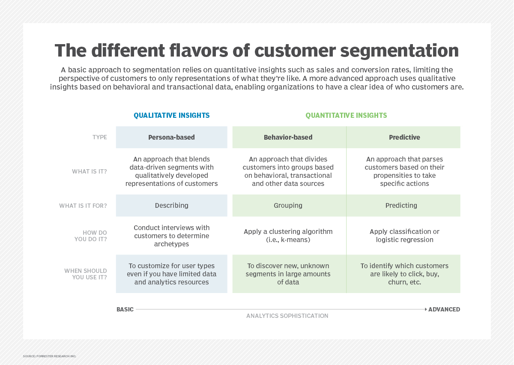
```

Dưới đây là ba phương pháp tiếp cận phổ biến trong phân khúc khách hàng:

| Phương pháp       | Đặc điểm chính                                                                 | Ứng dụng                                     |
|-------------------|----------------------------------------------------------------------------------|-----------------------------------------------|
| **Persona-based** | Định tính, dựa trên hồ sơ khách hàng mẫu                                       | Dữ liệu hạn chế hoặc nghiên cứu sơ khởi       |
| **Behavior-based**| Định lượng, dựa vào dữ liệu hành vi thực tế (ví dụ: RFM)                      | Phân tích từ dữ liệu giao dịch                |
| **Predictive**    | Dự đoán xu hướng tương lai (như khả năng mua, rời bỏ, nhấp chuột)             | Dùng khi có dữ liệu lớn và mô hình dự đoán   |

Trong thực tế, tiếp cận phân khúc theo hành vi **(behavior-based segmentation)** bằng mô hình RFM là một phương pháp phổ biến, đặc biệt phù hợp khi có sẵn dữ liệu lịch sử giao dịch. Phương pháp này giúp nhóm khách hàng theo đặc điểm tiêu dùng thực tế dựa trên ba yếu tố: **Recency** (gần nhất), **Frequency** (tần suất mua hàng), và **Monetary** (giá trị chi tiêu).

## **2.2. Mô hình RFM**

Mô hình **RFM (Recency – Frequency – Monetary)** là phương pháp phân tích hành vi khách hàng nhằm xác định nhóm khách mang lại giá trị cao nhất, từ đó tối ưu chiến lược tiếp cận và phân bổ nguồn lực.

Dựa trên nguyên lý **Pareto (80/20)**: *20% khách hàng tạo ra 80% doanh số*

**Ba thành phần của mô hình:**

```{r step2, echo=FALSE, fig.align='center', out.width='50%', fig.cap="Mô hình RFM", fig.pos='H'}
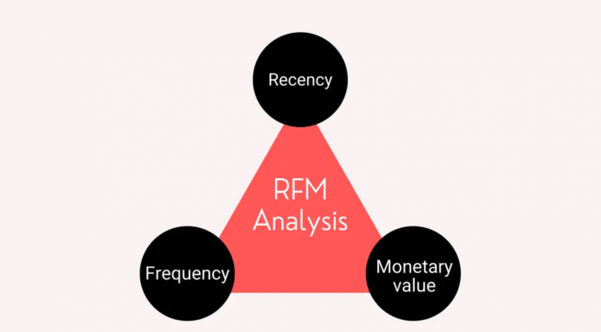
```

-  **Recency (R):** Thời gian kể từ lần mua gần nhất. Recency càng thấp, khách càng tiềm năng.

-  **Frequency (F):** Số lần mua hàng. Frequency cao thể hiện mức độ trung thành.

- **Monetary (M):** Tổng giá trị chi tiêu. Monetary cao phản ánh khách hàng giá trị lớn.

Các tổ chức lớn thường phân khúc khách hàng dựa trên các mức RFM khác nhau. Ví dụ, trong ngân hàng, khách hàng được phân thành các nhóm như *Mass*, *Affluent* và *Priority* theo giá trị đóng góp. Trong chứng khoán, phân khúc dựa vào tài sản ròng (*NAV*). Việc phân khúc này không chỉ giúp nâng cao sự hài lòng mà còn hỗ trợ phát triển sản phẩm phù hợp cho từng nhóm.[@noauthor_khoa_nodate]  

Trong các bài toán phân tích, mô hình RFM thường dùng làm công cụ **rút trích đặc trưng đầu vào** cho các thuật toán như **K-Means**. Việc mã hóa khách hàng qua ba chỉ số **R, F, M** giúp mô hình nhóm khách hàng hiệu quả mà không cần dữ liệu nhạy cảm, đặc biệt hữu ích trong các tình huống thực tế.

### *2.2.1 Ưu điểm của RFM*

Mô hình RFM giúp phân tích hành vi và tối ưu chiến lược tiếp thị hiệu quả. Theo **Harvard Business School**, việc tập trung vào nhóm khách hàng giá trị cao có thể giúp **tăng tỷ lệ chuyển đổi lên đến 750%** và **tăng doanh thu tới 300%**.[@noauthor_getting_nodate]

RFM hỗ trợ xác định các nhóm khách hàng như *Champions*, *Loyal Customers* hay *At-Risk Customers*, từ đó triển khai chương trình giữ chân phù hợp.
[@noauthor_rfm_nodate]. Nghiên cứu của **Bain & Company** cũng chỉ ra rằng chỉ cần giữ lại **5%** khách hàng trung thành có thể giúp tăng lợi nhuận từ **25% đến 95%**.[@noauthor_value_nodate]

Nhờ khả năng **định lượng hành vi và giá trị khách hàng**, RFM tạo nền tảng vững chắc cho việc cá nhân hóa và duy trì mối quan hệ dài hạn với nhóm khách hàng mục tiêu.[@noauthor_phan_nodate-2]

## **2.3. Chuẩn hóa dữ liệu (Standardization)**

Chuẩn hóa là bước tiền xử lý quan trọng nhằm đưa các đặc trưng về cùng thang đo, đặc biệt cần thiết khi dữ liệu có đơn vị đo khác nhau. Việc này giúp tránh các đặc trưng có giá trị lớn chi phối mô hình.

Trong các thuật toán dựa trên khoảng cách như **K-Means**, **PCA** hay **Mạng nơ-ron**, chuẩn hóa không chỉ giúp tăng độ chính xác và tốc độ huấn luyện, mà còn đảm bảo sự công bằng giữa các đặc trưng. Chuẩn hóa giữ nguyên mối quan hệ giữa các giá trị và giúp dữ liệu phù hợp hơn về mặt hình học và thống kê.

### *2.3.1. Cơ sở toán học của chuẩn hóa*

Phương pháp chuẩn hóa được sử dụng phổ biến nhất là chuẩn hóa theo phân phối chuẩn **(z-score normalization)**. Kỹ thuật này chuyển các giá trị của một đặc trưng về một thang đo mới có trung bình bằng 0 và độ lệch chuẩn bằng 1, theo công thức:

\[
z = \frac{x - \mu}{\sigma}
\]

Trong đó:

- \( x \): là giá trị gốc của một điểm dữ liệu.

- \( \mu \): là trung bình của toàn bộ đặc trưng đó.

- \( \sigma \): là độ lệch chuẩn tương ứng.

Việc chuẩn hóa theo **z-score** giúp tái định hình phân phối dữ liệu theo hướng loại bỏ ảnh hưởng của đơn vị đo lường và quy mô, qua đó tạo điều kiện thuận lợi cho các thuật toán phân tích hoạt động hiệu quả và ổn định hơn.

### *2.3.2. Lợi ích khi áp dụng chuẩn hóa*

Chuẩn hóa dữ liệu mang lại nhiều lợi thế trong quá trình xây dựng mô hình học máy:

- **Cân bằng đặc trưng:** Tránh biến có giá trị lớn lấn át các biến còn lại.

- **Giảm sai số tính toán:** Hạn chế lỗi làm tròn hoặc mất chính xác khi xử lý ma trận.

- **Tăng tốc huấn luyện:** Giúp tối ưu nhanh hơn, đặc biệt với các thuật toán như SGD.

- **Hỗ trợ trực quan:** Dữ liệu cùng khoảng giá trị dễ biểu diễn và so sánh hơn.

### *2.3.3. Hạn chế và điểm cần lưu ý*

Dù cần thiết trong nhiều trường hợp, chuẩn hóa dữ liệu cũng có một số điểm bất lợi. Việc loại bỏ đơn vị gốc khiến các giá trị trở nên khó diễn giải trực quan. Bên cạnh đó, với các thuật toán không dựa vào khoảng cách như cây quyết định hay rừng ngẫu nhiên, chuẩn hóa không bắt buộc. Ngoài ra, phương pháp **z-score** dễ bị sai lệch nếu dữ liệu chứa nhiều **ngoại lệ**, do phụ thuộc vào **giá trị trung bình** và **độ lệch chuẩn**.

### *2.3.4. Vai trò trong các thuật toán học máy*

Chuẩn hóa đóng vai trò quan trọng trong các mô hình học máy sử dụng khoảng cách (**K-Means**, **KNN**), tối ưu hóa đạo hàm (**Hồi quy tuyến tính**, **Logistic Regression**, **Deep learning**), hoặc giảm chiều (**PCA**). Việc đưa các đặc trưng về cùng thang đo giúp đảm bảo sự cân bằng trong đóng góp của mỗi biến, từ đó nâng cao độ chính xác và ổn định của mô hình.[@noauthor_feature_2024]

## **2.4. Ngoại lệ trong dữ liệu và vai trò trong phân tích**

### *2.4.1. Khái niệm ngoại lệ (Outlier)*

Trong thống kê và phân tích dữ liệu, **(outlier)** là những điểm dữ liệu có giá trị lệch một cách bất thường so với phần lớn các điểm còn lại trong tập dữ liệu. Những điểm này có thể là kết quả của lỗi đo lường, lỗi nhập liệu, hoặc phản ánh một hành vi đặc biệt trong thực tế.

```{r step3, echo=FALSE, fig.align='center', out.width='50%', fig.cap="Minh họa về outlier", fig.pos='H'}
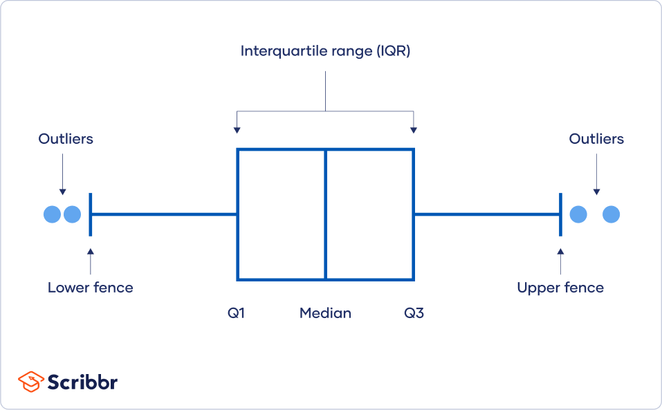
```

Tùy theo ngữ cảnh, **(outlier)** có thể chứa thông tin giá trị (ví dụ: khách hàng VIP chi tiêu cao bất thường) hoặc chỉ đơn thuần là nhiễu cần được loại bỏ.[@noauthor_web_2020]

### *2.4.2. Tác động của ngoại lệ đến phân tích và mô hình học máy*

Sự tồn tại của các giá trị ngoại lệ có thể **làm sai lệch kết quả phân tích**, đặc biệt trong các mô hình dựa trên khoảng cách (K-Means, KNN) hoặc độ lệch trung bình. Ngoại lệ có thể:

- Làm lệch **trung tâm cụm (centroid)** trong phân cụm K-Means.

- Gây ra hiện tượng **mô hình học bị lệch hoặc quá khớp**.

- Làm sai số trong **ước lượng thống kê** như trung bình hoặc phương sai.

Do đó, nhận diện và xử lý ngoại lệ là bước cần thiết trong tiền xử lý dữ liệu.

### *2.4.3. Phương pháp phát hiện ngoại lệ*

Một kỹ thuật phổ biến trong thống kê mô tả để phát hiện ngoại lệ là **IQR (Interquartile Range)**, dựa trên các tứ phân vị:

```{r step4, echo=FALSE, fig.align='center', out.width='50%', fig.cap="Phát hiện giá trị ngoại lệ bằng phương pháp IQR (Interquartile Range).", fig.pos='H'}
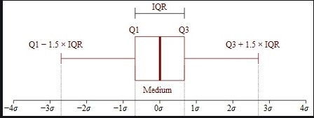
```

\[
\text{IQR} = Q3 - Q1
\]
\[
\text{Outlier if } x < Q1 - 1.5 \times IQR \quad \text{or} \quad x > Q3 + 1.5 \times IQR
\]

Trong đó:

- \( Q1 \): tứ phân vị thứ nhất (25% dưới cùng).

- \( Q3 \): tứ phân vị thứ ba (75% dưới cùng).

- \( x \): giá trị quan sát.

Bên cạnh đó, các phương pháp khác như **z-score**, **Mahalanobis distance**, hoặc trực quan hóa bằng **boxplot**, **scatter plot** cũng được sử dụng trong thực hành phân tích dữ liệu.[@noauthor_detecting_nodate]

### *2.4.4. Ưu điểm và nhược điểm của việc xử lý ngoại lệ*

#### Ưu điểm:

- **Cải thiện độ chính xác mô hình**: Khi loại bỏ nhiễu, mô hình học máy phản ánh đúng hơn mối quan hệ trong dữ liệu.

- **Tăng độ ổn định và khả năng tổng quát**: Hạn chế ảnh hưởng tiêu cực từ các điểm quá khác biệt.

- **Hỗ trợ phát hiện hành vi đặc biệt**: Có thể sử dụng để phát hiện gian lận, khách hàng đặc biệt, hoặc bất thường trong sản xuất.

#### Nhược điểm:

- **Nguy cơ mất thông tin giá trị**: Một số ngoại lệ không phải lỗi mà phản ánh hành vi thật sự (ví dụ: khách hàng VIP).

- **Phụ thuộc vào ngữ cảnh và ngành**: Không có quy tắc chung cho việc giữ hay loại bỏ — quyết định xử lý cần dựa vào hiểu biết nghiệp vụ.

- **Một số phương pháp phát hiện phụ thuộc phân phối dữ liệu**: Ví dụ, z-score giả định dữ liệu phân phối chuẩn nên không phù hợp với phân phối lệch.

### *2.4.5. Vai trò của xử lý ngoại lệ trong quá trình phân tích*

Xử lý ngoại lệ là bước tiền xử lý quan trọng nhằm đảm bảo tính ổn định và độ tin cậy cho các mô hình phân tích. Trong các thuật toán như K-Means, các điểm ngoại lệ có thể ảnh hưởng đến vị trí tâm cụm và kết quả phân nhóm, gây sai lệch trong diễn giải hành vi khách hàng.


Việc phát hiện và xử lý phù hợp giúp giảm thiểu rủi ro từ dữ liệu nhiễu mà không làm mất thông tin giá trị. Tuy nhiên, việc loại bỏ ngoại lệ cần dựa trên hiểu biết về bối cảnh và đặc điểm nghiệp vụ để tránh loại nhầm các mẫu quan trọng.

## **2.5. Thuật toán phân cụm K – Means**

### *2.5.1. Khái niệm về K – Means*

Thuật toán **K-Means** là một kỹ thuật học không giám sát phổ biến, được sử dụng để chia dữ liệu thành **các cụm** sao cho các điểm trong cùng cụm có độ **tương đồng cao**, trong khi khác biệt với các cụm còn lại. **K-Means** hoạt động bằng cách **tối thiểu hóa** tổng bình phương khoảng cách giữa **các điểm** và **tâm cụm**. Mỗi điểm được gán vào **cụm gần nhất** và **tâm cụm** được cập nhật liên tục cho đến khi **hội tụ**.[@son_k_nodate]

```{r step5, echo=FALSE, fig.align='center', out.width='50%', fig.cap="Minh họa về K - Means"}
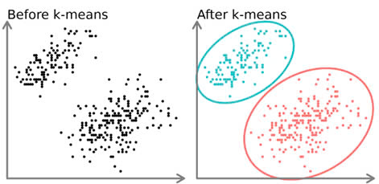
```

Mục tiêu chính của **K-Means** là giảm thiểu tổng bình phương khoảng cách giữa các điểm dữ liệu và trung tâm cụm của chúng, được gọi là **Within-Cluster Sum of Squares (WCSS)**:

$$WCSS = \sum_{i=1}^{K} \sum_{x \in C_i} \| x - \mu_i \|^2$$
Trong đó:

- $K$: Là số lượng cụm 

- $C_i$: Là tập hợp các điểm thuộc cụm thứ $i$  

- $\mu_i$: Là trung tâm (tâm cụm) của cụm thứ $i$

- $\|x - \mu_i\|^2$: Là bình phương khoảng cách Euclidean giữa điểm $x$ và tâm cụm $\mu_i$

### *2.5.2. Cách hoạt động của K-Means*

**Bước 1:** Chọn số lượng cụm

  - Xác định số lượng cụm $K$ mà ta sẽ nhóm dữ liệu. Ví dụ chọn $K = 3$.
  
**Bước 2:** Khởi tạo tâm cụm ban đầu

  -	Do vị trí chính xác của các tâm cụm chưa được biết, nên ở giai đoạn khởi tạo, thuật toán sẽ chọn ngẫu nhiên K điểm từ tập dữ liệu và coi đó là các tâm cụm ban đầu.

```{r step6, echo=FALSE, fig.align='center', out.width='30%', fig.cap="Ví dụ minh họa về khởi tạo tâm cụm"}
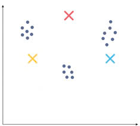
```


**Bước 3:** Gán điểm dữ liệu cho cụm gần nhất

  -	Sau khi đã có **tâm cụm** ban đầu, mỗi điểm dữ liệu sẽ được gán vào cụm có tâm **gần nhất**. Khoảng cách giữa điểm dữ liệu và tâm cụm thường được đo bằng khoảng cách **Euclidean**. Điểm dữ liệu sẽ thuộc về cụm có tâm mà nó có khoảng cách **Euclidean ngắn nhất**.

```{r step7, echo=FALSE, fig.align='center', out.width='40%', fig.cap="Ví dụ về gán điểm dữ liệu cho cụm cần nhất"}
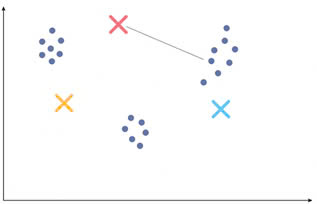
```

  - Đo khoảng cách từ các điểm tới tâm cụm bằng phép đo khoảng cách Euclidean.

$$d(x, y) = \sqrt{ \sum_{i=1}^{n} (x_i - y_i)^2 }$$

  - Sau đó chọn cụm cho dữ liệu có khoảng cách giữa các điểm dữ liệu và tâm nhỏ nhất.

```{r step8, echo=FALSE, fig.align='center', out.width='40%', fig.cap="Sau khi đo khoảng cách tâm tới điểm dữ liệu"}
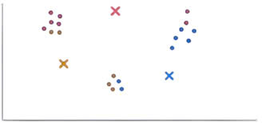
```
  


**Bước 4:** Khởi tạo lại tâm cụm

  - Khởi tạo lại trọng tâm bằng cách tính toán giá trị trung bình của tất cả các điểm dữ liệu của cụm đó.
  
$$C_i = \frac{1}{|N_i|} \sum x_i$$

Trong đó:

- $C_i$: là tâm cụm thứ $i$ (centroid của cụm $i$)  

- $N_i$: là tập các điểm thuộc cụm $i$  

- $|N_i|$: là số lượng điểm trong cụm $i$ (kích thước cụm)  

- $\sum x_i$: là tổng các vector dữ liệu $x_i$ trong cụm $i$

  
```{r step9, fig.align='center', echo=FALSE, out.width='40%',fig.cap="Sau khi khởi tạo lại tâm cụm"}
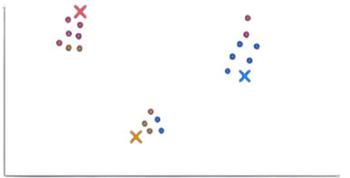
```

**Bước 5:** Lặp lại 

  -	Tiến hành lặp lại **bước 3** và **bước 4** cho đến khi có được trọng tâm **tối ưu** và việc chỉ định các điểm dữ liệu cho các cụm chính xác không còn thay đổi.[@sharma_k-means_2022]

```{r step10, echo=FALSE, fig.align='center', out.width='40%', fig.cap="Hoàn thành quá trình phân cụm"}
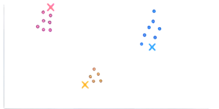
```

### *2.5.3. Lựa chọn số cụm \(K\) trong K-Means*

Một trong những yếu tố quan trọng ảnh hưởng đến hiệu quả phân cụm trong thuật toán **K-Means** là số lượng cụm \(K\). Nếu \(K\) được lựa chọn không hợp lý, mô hình có thể **bỏ sót** hoặc **chia nhỏ** không cần thiết các nhóm khách hàng **tiềm năng**. Do đó, việc xác định số cụm tối ưu là một bước thiết yếu trong quy trình phân tích. Các phương pháp đánh giá phổ biến sẽ được trình bày chi tiết trong phần **2.6.**

### *2.5.4. Ưu điểm và nhược điểm của K-Means*

**Ưu điểm:**

- **Đơn giản và dễ triển khai:** Cấu trúc thuật toán trực quan, dễ hiểu và phổ biến.

- **Xử lý nhanh:** Phù hợp với tập dữ liệu lớn nhờ tính toán hiệu quả.

- **Khả năng mở rộng tốt:** Có thể dùng cho dữ liệu lớn và phân cụm theo lô.

- **Linh hoạt:** Hoạt động tốt với dữ liệu đã chuẩn hóa và chuyển đổi thích hợp.

**Nhược điểm:**

- **Cần xác định trước số cụm \( K \):** Gây khó khăn khi không biết rõ cấu trúc dữ liệu.

- **Phụ thuộc khởi tạo ban đầu:** Cách chọn tâm cụm ảnh hưởng lớn đến kết quả cuối cùng.

- **Dễ bị ảnh hưởng bởi ngoại lệ:** Các giá trị cực đoan có thể làm sai lệch tâm cụm.[@admin_k-means_2024]

### *2.5.5. Ứng dụng của K-Means trong thực tế*

K-Means là một thuật toán phân cụm phổ biến, hiệu quả với dữ liệu số và liên tục. Một số ứng dụng tiêu biểu gồm:

- **Phân khúc khách hàng:** Nhóm người dùng theo hành vi tiêu dùng, hỗ trợ cá nhân hóa marketing và dịch vụ.

- **Phát hiện bất thường:** Xác định giao dịch gian lận, truy cập trái phép trong tài chính và an ninh mạng.

- **Phân loại tài liệu:** Trong NLP, giúp nhóm văn bản theo chủ đề dựa trên đặc trưng ngôn ngữ.

- **Xử lý ảnh và dữ liệu không gian:** Phân vùng ảnh theo màu sắc, độ sáng – hữu ích trong thị giác máy và chẩn đoán y tế.[@sharma_k-means_2022-1]

### *2.5.6. Giả định của thuật toán K-Means*

Để hoạt động hiệu quả, thuật toán K-Means ngầm định một số giả thiết về phân bố dữ liệu:

- **Cụm có dạng hình cầu** (hình elip đẳng phương): Các cụm phải có phương sai đồng đều và tách biệt rõ ràng theo khoảng cách Euclidean.

- **Kích thước cụm tương đương**: Nếu các cụm có mật độ điểm quá khác nhau, K-Means có thể phân chia sai.
- **Không có nhiễu mạnh (outliers)**: Do K-Means sử dụng trung bình cụm làm đại diện, nên dễ bị lệch bởi các giá trị cực đoan.

- **Dữ liệu số và liên tục**: K-Means không hoạt động tốt với dữ liệu phân loại hoặc thứ bậc trừ khi được mã hóa lại phù hợp.

Việc hiểu rõ các giả định này giúp nhà phân tích lựa chọn đúng thuật toán hoặc tiền xử lý dữ liệu tương ứng để đảm bảo hiệu quả phân cụm.

## **2.6. Các phương pháp chọn số cụm tối ưu**

Việc xác định số cụm  \( K \)  hợp lý là yếu tố **then chốt** trong phân cụm. Nếu  \( K \) quá nhỏ, mô hình **bỏ sót** các nhóm tiềm năng; nếu quá lớn, dễ dẫn đến **quá khớp** và **mất tính khái quát**. Để chọn được \( K \) tối ưu, có thể áp dụng một số phương pháp phổ biến như **Elbow**, **Silhouette**, **Calinski-Harabasz** và **Davies-Bouldin**.

### *2.6.1. Phương pháp Elbow (Khuỷu tay)*

Tìm số lượng cụm sao cho tổng phương sai trong cụm (**WSS - within-cluster sum of squares**) là nhỏ nhất, nhưng không giảm quá nhiều khi tăng thêm cụm. 

```{r step11, echo=FALSE, fig.align='center', out.width='50%', fig.cap="Elbow method"}
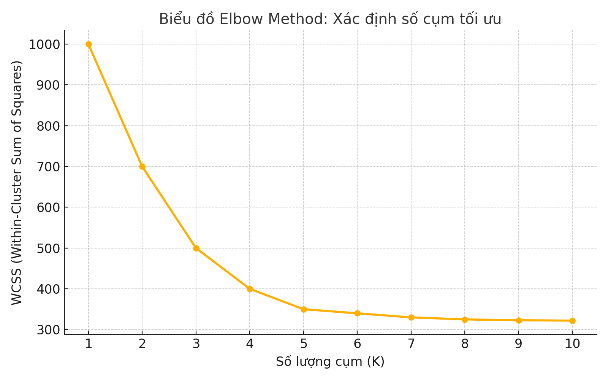
```

**Công thức WCSS:**

$$
WCSS = \sum_{i=1}^{K} \sum_{x \in C_i} \| x - \mu_i \|^2
$$

**Cách thực hiện:**
  
  1.  Thực hiện phân cụm với các giá trị K khác nhau (ví dụ từ 1 đến 10).
  
  2.  Tính tổng WSS cho mỗi K.
  
  3.  Vẽ biểu đồ WSS theo số cụm K.
  
  4.  Điểm "gấp khúc" (**elbow**) trên đồ thị thường là nơi phù hợp để chọn K.

**Ứng dụng của phương pháp Elbow**

Phương pháp **Elbow** hữu ích trong các trường hợp sau:

- **Học không giám sát:** Khi làm việc với dữ liệu chưa được gắn nhãn.

-	**Phân tích dữ liệu thăm dò (EDA):** Dùng để xác định số lượng cụm khi không biết trước.

-	**Phân cụm K-Means:** Phương pháp chính thường dùng cho K-Means.

-	**Xử lý dữ liệu ở giữa chừng:** Sử dụng sau khi làm sạch dữ liệu nhưng trước khi mô hình hóa phức tạp hơn.

**Hạn chế của Elbow**

Dù dễ áp dụng, phương pháp **Elbow** có hạn chế:

-	**Tính chủ quan:** Điểm khuỷu tay có thể khó xác định khi đồ thị không rõ ràng.

-	**Giả định hình cầu:** Không phù hợp với các cụm không đồng đều.

-	**Tính đa chiều:** Dữ liệu có nhiều chiều có thể gây biến dạng hình khuỷu tay.

-	**Chi phí tính toán:** Tính WCSS cho nhiều giá trị k tốn kém, đặc biệt với dữ liệu lớn.[@kaur_determining_2025]


### *2.6.2.  Phương pháp Silhouette*

Đánh giá mức độ phù hợp của từng điểm dữ liệu với cụm của nó. Giá trị **Silhouette** càng gần **1** cho thấy điểm đó nằm **“đúng”** trong cụm hơn.

```{r step12, echo=FALSE, fig.align='center', out.width='50%', fig.cap="Silhoutte Plot"}
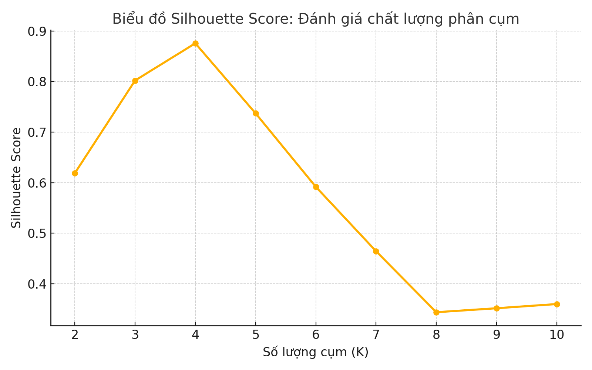
```

**Cách thực hiện:**
  
  1. Phân cụm dữ liệu với các giá trị **khác nhau**.
    
  2. Tính **độ rộng Silhouette trung bình** cho mỗi giá trị \( K \).
    
  3. Vẽ đồ thị **Silhouette** theo \( K \).
    
  4. Chọn \( K \) tại vị trí có giá trị **Silhouette trung bình** lớn nhất.
    
**Công thức Silhouette**:

$$
s(i) = \frac{b(i) - a(i)}{\max(a(i),\ b(i))}
$$

Trong đó:

&nbsp;&nbsp;&nbsp;&nbsp;&nbsp;&nbsp;&nbsp;&nbsp;&nbsp;&nbsp; *\( a(i) \)*: Khoảng cách trung bình từ điểm *i* đến tất cả các điểm khác trong **cùng cụm**.

&nbsp;&nbsp;&nbsp;&nbsp;&nbsp;&nbsp;&nbsp;&nbsp;&nbsp;&nbsp; *\( b(i) \)*: Khoảng cách trung bình nhỏ nhất từ điểm *i* đến các điểm trong **cụm khác gần nhất**.

- **Kết quả Silhouette trả về nằm trong khoảng** \([-1, 1]\):

  - Gần **1**: Điểm dữ liệu được phân cụm **rất tốt**.
  
  - Gần **0**: Điểm dữ liệu nằm ở **ranh giới giữa hai cụm**.
  
  - Gần **-1**: Điểm dữ liệu có thể bị **phân cụm sai hoàn toàn**.

- **Đánh giá chất lượng phân cụm dựa trên Silhouette trung bình**:

  - **0.71 – 1.00**: Cấu trúc phân cụm **mạnh**.
  
  - **0.51 – 0.70**: Cấu trúc phân cụm **hợp lý**.
  
  - **0.26 – 0.50**: Cấu trúc phân cụm **yếu**, nên **xem xét lại**.
  
  - **≤ 0.25**: **Không phát hiện được** cấu trúc phân cụm rõ ràng.
  
**Hạn chế của phương pháp Silhouette**

-	**Khó xác định số cụm tối ưu khi dữ liệu có cấu trúc phức tạp:** Trong trường hợp các cụm có hình dạng không đồng nhất hoặc không hình cầu, **Silhouette Score** có thể không đưa ra kết quả chính xác về số lượng cụm tối ưu.
-	**Độ phức tạp tính toán:** Tính toán **Silhouette Score** cho toàn bộ tập dữ liệu có thể tốn kém về thời gian và tài nguyên, đặc biệt đối với các tập dữ liệu lớn

**Ứng dụng thực tế**

-	Phương pháp **Silhouette Score** thường được sử dụng cùng với các phương pháp khác như **Elbow Method** để xác định số lượng cụm **tối ưu** trong phân tích phân cụm, đặc biệt là khi dữ liệu có sự **chồng lấn** giữa các nhóm.[@noauthor_silhouette_2025]

### *2.6.3. Phương pháp Calinski–Harabasz (CH Index)*

Phương pháp **Calinski-Harabasz Index (CH Index)** là một chỉ số đánh giá **chất lượng phân cụm**, được sử dụng để **đo lường** mức độ phân tách giữa các cụm và **độ gắn kết** nội bộ trong mỗi cụm. Chỉ số này **càng cao** thì chất lượng phân cụm **càng tốt**, vì nó cho thấy rằng các cụm có sự **tách biệt** rõ ràng và đồng thời các điểm dữ liệu trong cùng một cụm có tính **đồng nhất cao**.

```{r step13, echo=FALSE, fig.align='center', out.width='50%', fig.cap="Calinski–Harabasz", fig.pos='H'}
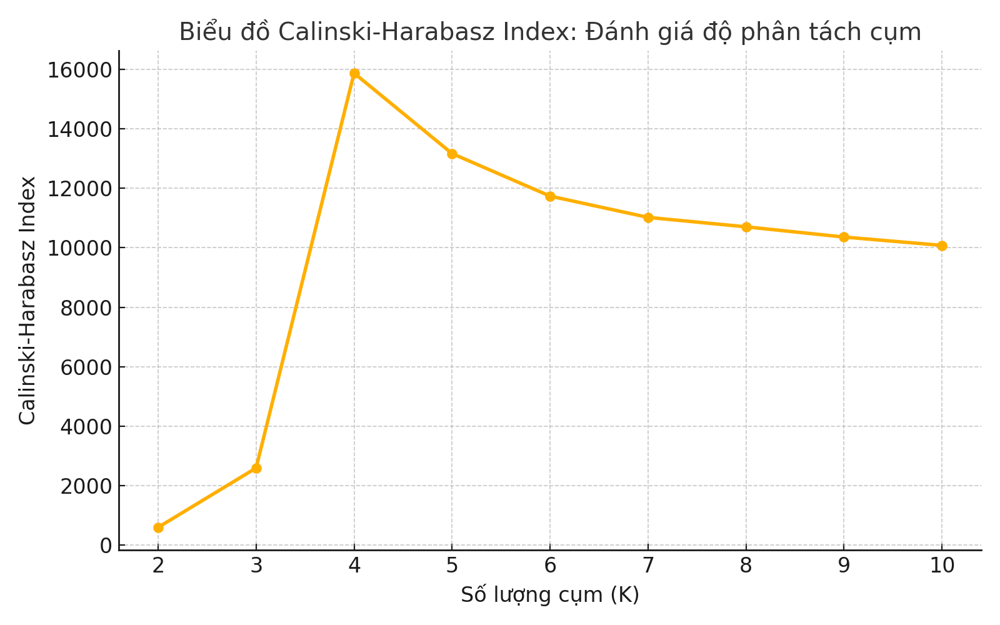
```

**Công thức:**

\[
CH = \frac{BCSS / (K - 1)}{WCSS / (n - K)}
\]

Trong đó:

- **BCSS (Between-Cluster Sum of Squares):** Phương sai giữa các cụm, đo lường sự phân tách giữa các cụm. BCSS càng lớn, các cụm càng phân tách rõ ràng.

$$
\mathrm{BCSS} = \sum_{i=1}^{k} n_i (\mu_i - \mu)^2
$$

  - Trong đó:

    - \( n_i \): Số điểm dữ liệu trong cụm \( i \).
  
    - \( \mu_i \): Tâm của cụm \( i \).
  
    - \( \mu \): Tâm trung bình của toàn bộ dữ liệu


- **WCSS (Within-Cluster Sum of Squares):** Phương sai trong các cụm, đo lường sự đồng nhất của các điểm trong cùng một cụm. WCSS càng nhỏ, các điểm trong mỗi cụm càng đồng nhất.

$$
\mathrm{WCSS} = \sum_{i=1}^{k} \sum_{x \in C_i} (x - \mu_i)^2
$$

  - Trong đó:

    - \( C_i \): Tập hợp các điểm dữ liệu trong cụm \( i \).
  
    - \( \mu_i \): Tâm của cụm \( i \).
  
    - \( x \): Một điểm dữ liệu trong cụm \( i \).


- \( K \): số cụm.

- \( n \): số lượng điểm dữ liệu.

**Ý nghĩa của Calinski-Harabasz Index**

- **Giá trị cao:** CH Index cao cho thấy các cụm có sự phân tách rõ ràng và các điểm trong mỗi cụm có tính đồng nhất cao, tức là phân cụm tốt.

-	**Giá trị thấp:** CH Index thấp cho thấy các cụm có sự chồng lấn hoặc các điểm dữ liệu trong cùng một cụm có sự khác biệt lớn, tức là phân cụm kém chất lượng

**Ưu điểm**

-	**Đơn giản và dễ hiểu:** Công thức tính đơn giản và dễ triển khai.

-	**Phù hợp với dữ liệu có nhiều chiều:** Calinski-Harabasz Index có thể được sử dụng hiệu quả với dữ liệu có nhiều chiều.

**Hạn chế**

-	**Phụ thuộc vào số lượng điểm dữ liệu:** CH Index có thể bị ảnh hưởng bởi số lượng điểm dữ liệu, cần lưu ý khi so sánh các tập dữ liệu có kích thước khác nhau.

-	**Không phù hợp với dữ liệu có cấu trúc phức tạp:** CH Index có thể không chính xác với dữ liệu có cấu trúc không đồng nhất hoặc phức tạp.

**Ứng dụng thực tế**

**Calinski-Harabasz Index** thường được sử dụng kết hợp với các phương pháp như **Elbow Method** và **Silhouette Score** để xác định số lượng cụm tối ưu trong phân tích phân cụm. Sự kết hợp giữa các chỉ số giúp chọn lựa số lượng cụm tối ưu một cách chính xác hơn.[@noauthor_calinskiharabasz_2025] 

### *2.6.4. Chỉ số Davies–Bouldin (DBI)*

**Davies-Bouldin Index (DBI)** là một chỉ số dùng để đánh giá **chất lượng phân cụm** trong thuật toán **K-Means** hoặc bất kỳ phương pháp phân cụm nào khác. Chỉ số này đo lường mức độ **chồng lấn** giữa các cụm và mức độ **đồng nhất** trong mỗi cụm. **Davies-Bouldin Index** càng thấp, thì phân cụm **càng tốt**, vì điều này cho thấy các cụm **ít chồng lấn** và có sự phân tách **rõ ràng** giữa các cụm.

```{r step14, echo=FALSE, fig.align='center', out.width='50%', fig.cap="Davies–Bouldin", fig.pos='H'}
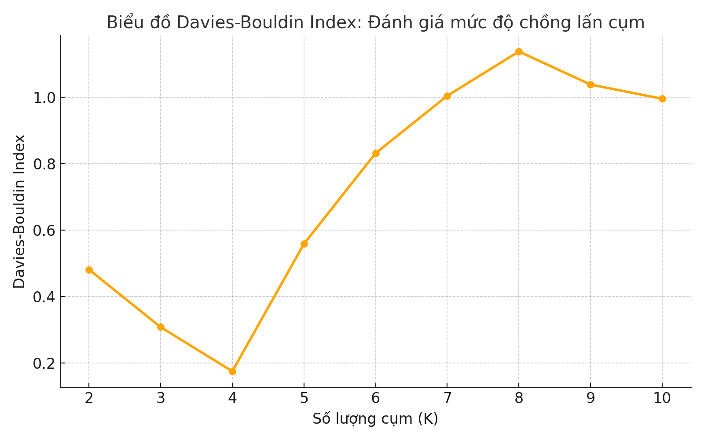
```

**Công thức:**

$$
DBI = \frac{1}{k} \sum_{i=1}^{k} \max_{j \ne i} \frac{S_i + S_j}{d(C_i, C_j)}
$$

Trong đó:

- \( k \): Số lượng cụm.

- \( S_i \): Độ phân tán nội cụm của cụm \( i \), tính là phương sai giữa các điểm trong cụm \( i \).

- \( d(C_i, C_j) \): khoảng cách giữa tâm cụm \( i \) và \( j \).

- \(C_i \): Các cụm khác nhau

**Ý nghĩa của Davies-Bouldin Index**

-	**Giá trị thấp**: **DBI thấp** cho thấy các cụm có sự phân tách rõ ràng và ít chồng lấn, nghĩa là phân cụm tốt.

-	**Giá trị cao**: **DBI cao** cho thấy có sự chồng lấn giữa các cụm và các cụm có sự phân tán lớn, nghĩa là phân cụm không tốt.

**Ưu điểm:** 

-	**Đơn giản và dễ sử dụng:** Chỉ số DBI dễ tính toán và triển khai, đặc biệt khi cần so sánh giữa nhiều số lượng cụm khác nhau.

-	**Chỉ số trực quan:** Chỉ số này dễ dàng giải thích và sử dụng để đánh giá sự phân tách giữa các cụm.

**Nhược điểm:**

-	**Không hoàn toàn chính xác khi các cụm không đồng đều:** DBI có thể không phản ánh chính xác chất lượng phân cụm khi các cụm có hình dạng không đồng nhất hoặc có sự phân tán rất khác nhau.

-	**Chỉ số phụ thuộc vào khoảng cách giữa các cụm:** Khi khoảng cách giữa các cụm không rõ ràng hoặc dữ liệu có nhiều chiều, DBI có thể không phản ánh đúng mức độ phân tách của các cụm.

**Ứng dụng thực tế**

**Davies-Bouldin Index** thường được sử dụng để đánh giá chất lượng phân cụm khi cần đảm bảo rằng các cụm có sự phân tách rõ ràng và đồng nhất. DBI có thể kết hợp với các phương pháp khác như **Elbow Method** hoặc **Silhouette Score** để đưa ra quyết định chính xác hơn về số lượng cụm tối ưu.[@noauthor_davies-bouldin_nodate] 

## **2.7. Kỹ thuật giảm chiều để trực quan hóa**

Giảm chiều dữ liệu là quá trình **chuyển đổi** dữ liệu từ không gian **nhiều chiều** sang không gian **ít chiều** hơn, trong khi vẫn giữ lại các đặc trưng **quan trọng**. Phương pháp này giúp **giảm độ phức tạp**, **loại bỏ nhiễu** và **tăng khả năng diễn giải**.

Trong phân tích hành vi khách hàng bằng mô hình **RFM** (**Recency**, **Frequency**, **Monetary**), giảm chiều đặc biệt **hữu ích** cho **trực quan hóa**, giúp dễ dàng **nhận diện** cấu trúc dữ liệu và các **nhóm khách hàng** tiềm năng.[@noauthor_giam_2023]

```{r step15, echo=FALSE, fig.align='center', out.width='70%', fig.cap="Kỹ thuật giảm chiều"}
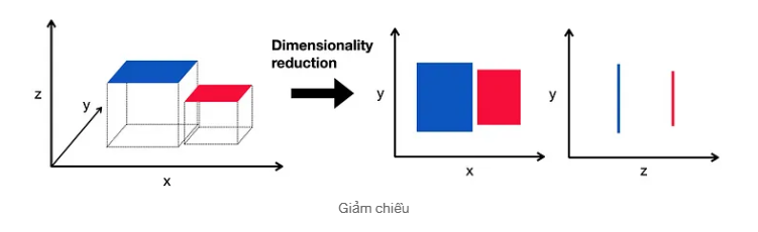
```

### *2.7.1. PCA (Principal Component Analysis).*

Phân tích thành phần chính (**PCA**) là một kỹ thuật thống kê được sử dụng để giảm số chiều của dữ liệu đa chiều. **PCA** chuyển đổi dữ liệu gốc thành một tập hợp các thành phần chính - những hướng mới mà dữ liệu biến động nhiều nhất - đồng thời giữ lại càng nhiều thông tin **(phương sai)** càng tốt.

```{r step16, echo=FALSE, fig.align='center', out.width='70%', fig.cap="PCA"}
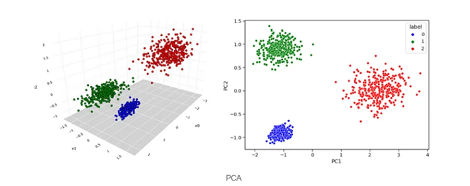
```

**Cách hoạt động của PCA:**

  - **Chuẩn hóa dữ liệu:** Đưa các biến về cùng thang đo (trung bình = 0, độ lệch chuẩn = 1).
  
  - **Tính ma trận hiệp phương sai:**Xác định mối quan hệ và mức độ phân tán giữa các biến.
  
  - **Tính vectơ riêng và giá trị riêng:** Vectơ riêng cho biết hướng chính, giá trị riêng thể hiện mức độ biến động theo hướng đó.
  
  - **Lựa chọn thành phần chính:** Các vectơ riêng ứng với giá trị riêng lớn nhất được chọn làm thành phần chính, giúp giảm số chiều dữ liệu trong khi giữ lại phần lớn thông tin quan trọng.
  
  - **5. Chiếu dữ liệu:** Vectơ riêng cho biết hướng chính, giá trị riêng thể hiện mức độ biến động theo hướng đó.

**Ưu điểm của PCA:**

  - **Giảm chiều hiệu quả** mà vẫn bảo toàn phần lớn thông tin.
  
  - **Tiết kiệm tài nguyên** tăng tốc xử lý và giảm chi phí tính toán
  
  - **Giảm thiểu đa cộng tuyến** tăng tốc xử lý và giảm chi phí tính toán
  
  - **Dễ hiểu và triển khai** được ứng dụng rộng rãi trong nhiều lĩnh vực
  
  - **Hỗ trợ trực quan hóa** tốt ở không gian 2D/3D giúp phân tích dễ dàng hơn.

**Khi nào nên sử dụng PCA**

  - Khi cần **giảm số biến đầu vào** nhưng vẫn giữ được phần lớn thông tin.
  
  - Khi muốn **đơn giản hóa mô hình** và giảm chi phí tính toán.
  
  - Khi xử lý **dữ liệu đa chiều** trong phân tích khám phá hoặc trực quan hóa.
  
  - Khi cần **hạn chế hiện tượng quá khớp** và cải thiện độ ổn định của mô hình học máy.[@noauthor_pca_2024]

### *2.7.2. t-SNE (t-distributed Stochastic Neighbor Embedding).*

**Khái niệm về t-SNE**

**t-Distributed Stochastic Neighbor Embedding (t-SNE)** là kỹ thuật giảm chiều **phi tuyến**, chủ yếu dùng để trực quan hóa dữ liệu **đa chiều**. Phương pháp này rất hiệu quả trong việc **bảo toàn** cấu trúc cục bộ và làm **nổi bật** các cụm trong dữ liệu nhiều chiều.

```{r step17, echo=FALSE, fig.align='center', out.width='60%', fig.cap="t-SNE"}
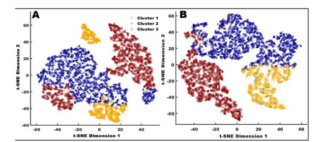
```

**Cách hoạt động của t-SNE:**

  - **Tính toán độ tương đồng:**Chuyển khoảng cách giữa các điểm thành xác suất thể hiện mức độ gần nhau trong không gian cao chiều.
  
  - **Ánh xạ chiều thấp:** Duy trì xác suất tương đồng trong không gian 2D/3D.
  
  - **Tối ưu hóa:** Giảm sai lệch giữa hai phân phối bằng thuật toán giảm dần độ dốc.

**Khi nào sử dụng t-SNE:**

  - Khi cần trực quan hóa dữ liệu nhiều chiều.
  
  - Để phân biệt các nhóm/cụm dữ liệu tiềm ẩn.
  
  - Khi muốn hiểu mối quan hệ nội tại trong dữ liệu.

**Ưu điểm:**

  - Giữ được mối quan hệ cục bộ giữa các điểm dữ liệu.
  
  - Phù hợp với dữ liệu phi tuyến và cấu trúc phức tạp.
  
  - Giúp trực quan hóa rõ ràng các nhóm hoặc cụm nhỏ.

**Nhược điểm:**

  - Tốn nhiều thời gian và tài nguyên với dữ liệu lớn.
  
  - Nhạy cảm với tham số (perplexity).
  
  - Không giữ cấu trúc toàn cục, khoảng cách giữa cụm có thể không chính xác.

**Ứng dụng:**

**t-SNE** thường dùng để trực quan hóa kết quả phân cụm khách hàng theo RFM, giúp nhận diện nhóm hành vi, ngoại lệ và đánh giá hiệu quả phân nhóm [@noauthor_pca_2024]


\newpage

# **CHƯƠNG 3: PHƯƠNG PHÁP THỰC NGHIỆM**

## **3.1. Quá trình thực nghiệm**

### *3.1.1. Mục tiêu của quá trình thực nghiệm*

Quá trình thực nghiệm được thực hiện nhằm phân nhóm khách hàng dựa trên hành vi tiêu dùng. Bằng cách kết hợp mô hình **RFM** và thuật toán **K-Means**, mục tiêu là xác định các cụm khách hàng có đặc điểm **tương đồng** để phục vụ các chiến lược tiếp thị hiệu quả hơn.

### *3.1.2. Sơ đồ quy trình*

```{r step18, echo=FALSE, fig.align='center', out.width='60%', fig.cap="Sơ đồ các bước thực hiện trong phân tích hành vi và phân cụm khách hàng.", fig.pos='H'}
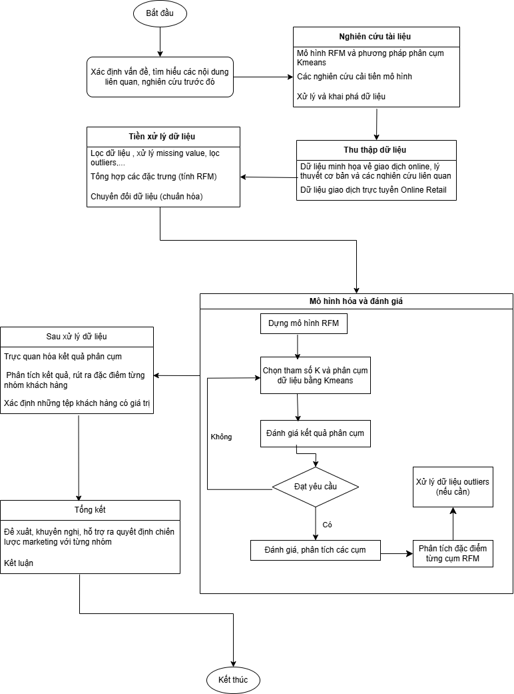
```

## **3.2. Giới thiệu tập dữ liệu**

### *3.2.1. Nguồn gốc và bối cảnh dữ liệu*

Tập dữ liệu được sử dụng trong đề tài được lấy từ **UCI Machine Learning Repository**, thuộc nhóm dữ liệu **Online Retail**, ghi lại các giao dịch trong khoảng thời gian từ **tháng 12/2010 đến tháng 12/2011** của một doanh nghiệp bán lẻ tại Anh. Dữ liệu phản ánh lịch sử mua sắm của khách hàng thông qua các hóa đơn điện tử, phù hợp để phân tích hành vi tiêu dùng.

### *3.2.2. Mô tả cấu trúc và các thuộc tính chính*

Dữ liệu gồm **541.909 dòng** và **8 cột** chính:

  - `InvoiceNo:` Mã số hóa đơn

  - `StockCode:` Mã sản phẩm

  - `Description:` Mô tả sản phẩm

  - `Quantity:` Số lượng sản phẩm bán ra

  - `InvoiceDate:` Ngày giao dịch

  - `UnitPrice:` Giá đơn vị (tính bằng bảng Anh)

  - `CustomerID:` Mã khách hàng

  - `Country:` Quốc gia nơi khách hàng thực hiện giao dịch

### *3.2.3. Ý nghĩa các biến trong phân tích hành vi khách hàng*

Trong bài toán phân khúc khách hàng, các biến quan trọng được sử dụng để tính chỉ số RFM bao gồm:

  - `InvoiceDate:` Dùng để tính **Recency** - số ngày kể từ lần mua hàng gần nhất.

  - `InvoiceNo:` Dùng để tính **Frequency** - số lần khách hàng thực hiện giao dịch.

  - `Quantity` và `UnitPrice:` Kết hợp để tính **Monetary** - tổng giá trị chi tiêu.

  - `CustomerID:` Khóa chính để nhóm và theo dõi từng khách hàng.

```{python include=FALSE}
# library import
import pandas as pd
import seaborn as sns
import numpy as np
import matplotlib.pyplot as plt
from sklearn.neighbors import NearestNeighbors
import seaborn as sns
from datetime import datetime, timedelta
from sklearn.metrics import silhouette_score
#import plotly.offline as pyoff
#import plotly.graph_objs as go
from sklearn.preprocessing import StandardScaler
```

```{python include=FALSE}
df=pd.read_excel(r"Online Retail.xlsx")
df
```

## **3.3. Khám phá dữ liệu**

### *3.3.1. Thống kê mô tả tổng quan tập dữ liệu*

Tập dữ liệu gồm hơn **500.000** dòng, ghi nhận các giao dịch bán hàng của một doanh nghiệp bán lẻ trực tuyến tại Anh trong khoảng một năm. Việc thống kê sơ bộ cho thấy dữ liệu chứa các giá trị trùng lặp, thiếu mã khách hàng và một số bất thường về số lượng, giá sản phẩm.

Về kiểu dữ liệu, phần lớn các cột đã ở định dạng phù hợp. Đáng chú ý, `InvoiceDate` đã được chuyển sang kiểu `datetime64[ns]`, hỗ trợ tốt cho việc tính toán chỉ số Recency. Các cột định lượng như `Quantity` và `UnitPrice` có kiểu số `(int64, float64)`, sẵn sàng cho bước xử lý tiếp theo.

```{python echo=FALSE}
# Thong tin tong quan
print("=== Thong tin chung ===")
print(df.info())
```

### *3.3.2. Kiểm tra giá trị thiếu và kiểu dữ liệu*

Trước khi tiến hành xử lý và phân tích, cần kiểm tra tình trạng thiếu dữ liệu và kiểu dữ liệu của các trường trong tập dữ liệu.

```{python echo=FALSE}
from IPython.display import display

display("=== So luong gia tri thieu ===") 
display(df.isnull().sum())
```

Kết quả cho thấy cột `CustomerID` có **135.080 giá trị bị thiếu**, chiếm khoảng **25%** tổng số dòng. Ngoài ra, cột `Description` cũng thiếu **1.454 giá trị**, tuy nhiên đây không phải là biến chính trong phân tích RFM nên sẽ không ảnh hưởng lớn đến kết quả. Các cột còn lại không có giá trị thiếu.

```{python eval=FALSE, include=FALSE}
# Kiem tra kieu du lieu cua cac cot
print("=== Kieu du lieu ===")
print(df.dtypes)
```

```{python include=FALSE}
#Kiem tra 5 dong dau
print("=== 5 dong dau ===")
df.head()
```

### *3.3.3. Phân tích các giá trị và mã bất thường*

```{python include=FALSE}
#  Kiem tra so dong co gia tri am hoac bang 0
print("=== So dong Quantity <= 0 ===")
print((df['Quantity'] <= 0).sum())
```

```{python include=FALSE}
print("=== So dong UnitPrice <= 0 ===")
print((df['UnitPrice'] <= 0).sum())
```

```{python include=FALSE}
# So luong khach hang duy nhat (bo qua NaN)
print("=== So luong khach hang duy nhat (co CustomerID) ===")
print(df['CustomerID'].nunique(dropna=True))
```

```{python include=FALSE}
#Khoang thoi gian giao dich (InvoiceDate chua chuyen sang datetime)
print("=== Khoang thoi gian InvoiceDate ===")
print("From:", df['InvoiceDate'].min(), "to", df['InvoiceDate'].max())
```

```{python include=FALSE}
# kiem tra col 'InvoiceNo' co ky tu nao khac ngoai so ko
df['InvoiceNo'].str.replace("[0-9]","",regex=True).unique()
```

```{python echo=FALSE}
# Dem so hoa don bat dau bang 'C' (cancelled invoices)
cancelled_invoices = df[df['InvoiceNo'].str.startswith('C', na=False)]

# Dem so hoa don co chua 'A'
a_invoices = df[df['InvoiceNo'].str.contains('A', na=False)]


# (Tuy chon) In mot vai vi du de quan sat truc tiep
print("=== Vi du hoa don bi huy (C...) ===")
print(cancelled_invoices[['InvoiceNo', 'Quantity', 'CustomerID']].head())

print("=== Vi du hoa don chua 'A' ===")
print(a_invoices[['InvoiceNo', 'Quantity', 'CustomerID']].head())
```

Trong quá trình khám phá dữ liệu, nhóm phát hiện nhiều giá trị **không hợp lệ** hoặc **bất thường** có thể ảnh hưởng đến kết quả phân tích hành vi tiêu dùng:

Có **10.624** dòng có `Quantity` ≤ 0 và **2.517** dòng có **`UnitPrice` ≤ 0**. Đây thường là các giao dịch **bị hủy**, **hoàn trả** hoặc **lỗi nhập liệu**. Những dòng này chưa bị loại bỏ ngay mà sẽ được xử lý trong bước tính chỉ số **Monetary** để đảm bảo không ảnh hưởng đến các phân tích khác.

Một số dòng có `Quantity` hoặc `UnitPrice` quá cao cũng được ghi nhận và sẽ kiểm tra kỹ hơn ở bước xử lý ngoại lệ.

Về khách hàng và thời gian, tập dữ liệu còn lại bao gồm **4.372** khách hàng có mã `CustomerID`, với giao dịch trải dài từ **01/12/2010** đến **09/12/2011**, cung cấp đủ thông tin để phân tích theo chu kỳ hành vi.

Trường `InvoiceNo` cho thấy có **9.288** hóa đơn bị hủy (ký hiệu bắt đầu bằng “C”), thường đi kèm số lượng âm. Một số mã khác như **“A”** không có `CustomerID` cũng được xác định là không hợp lệ.

Đối với `StockCode`, nhiều mã không đại diện cho sản phẩm (như **POST**, **DOT**, **BANK** **CHARGES**, **gift_0001_30**,...) phản ánh các phí hoặc quà tặng thay vì hành vi tiêu dùng thực tế, sẽ được loại bỏ trước khi tính chỉ số RFM.

Tóm lại, dữ liệu có độ phủ tốt nhưng tồn tại nhiều giá trị và mã không hợp lệ. Việc phát hiện và xử lý các bất thường này là bước quan trọng giúp đảm bảo chất lượng dữ liệu đầu vào cho phân tích RFM và phân cụm.

```{python include=FALSE}
# Tim trong cot 'StockCode' co gia tri nao khong dung 5 chu so va khong co chu cai kem theo
df['StockCode']=df['StockCode'].astype('str')
# Tim trong cot 'StockCode' co gia tri nao khong dung 5 chu so va khong co chu cai kem theo
df[(df['StockCode'].str.match("^\\d{5}$")==False)&(df['StockCode'].str.match("^\\d{5}[a-zA-Z]+$")==False)]['StockCode'].unique()
```

```{python include=FALSE}
# Copy du lieu goc de xu ly
df_cleaned = df.copy()
```

## **3.4. Làm sạch và xử lý dữ liệu**

### *3.4.1. Loại bỏ các giao dịch không hợp lệ*

Trên cơ sở kết quả khám phá dữ liệu, nhóm đã tiến hành loại bỏ các dòng giao dịch không hợp lệ nhằm đảm bảo đầu vào sạch cho quá trình tính toán chỉ số hành vi. Hai tiêu chí chính được sử dụng để lọc dữ liệu gồm:

```{python include=FALSE}
#Xu ly 'InvoiceNo'
# Chuyen ve kieu chuoi
df_cleaned['InvoiceNo'] = df_cleaned['InvoiceNo'].astype(str)
# Giu lai cac hoa don dung dinh dang 6 chu so
invoice_mask = df_cleaned['InvoiceNo'].str.match(r'^\d{6}$')
df_cleaned = df_cleaned[invoice_mask]
```

```{python echo=FALSE}
# Kiem tra lai so luong hoa don
print("=== So luong hoa don sau khi xu ly ===")
print(df_cleaned['InvoiceNo'].nunique())
```

**Mã hóa đơn không hợp lệ:** Các `InvoiceNo` bị hủy (bắt đầu bằng chữ “C”) hoặc không tuân thủ định dạng chuẩn gồm **6 chữ số liên tiếp** đã được loại bỏ. Đây là những hóa đơn không đại diện cho giao dịch hoàn chỉnh hoặc không thể truy xuất rõ ràng. Sau khi lọc, số hóa đơn hợp lệ còn lại là **22.061 hóa đơn duy nhất.**

```{python include=FALSE}
# Buoc 3: Xu ly 'StockCode'
df_cleaned.loc[:, 'StockCode'] = df_cleaned['StockCode'].astype(str)
stockcode_mask = (
    df_cleaned['StockCode'].str.match(r'^\d{5}$') |
    df_cleaned['StockCode'].str.match(r'^\d{5}[a-zA-Z]+$') |
    df_cleaned['StockCode'].str.match(r'^PADS$')
)
df_cleaned = df_cleaned[stockcode_mask]
df_cleaned
```

```{python echo=FALSE}
print("===  So luong StockCode sau khi xu ly ===")
print(df_cleaned['StockCode'].nunique())
```

**Mã sản phẩm không phù hợp:** Một số `StockCode` không phản ánh hành vi tiêu dùng thực tế như `POST, DOT, BANK CHARGES, gift_0001_30, v.v...` cũng được loại bỏ. Nhóm chỉ giữ lại các mã sản phẩm thực (có 5 chữ số hoặc theo mẫu ký hiệu cụ thể), cùng với mã đặc biệt “PADS” thuộc nhóm phân tích trọng tâm. Sau bước này, còn lại **4.029 mã sản phẩm hợp lệ.**

Kết quả sau khi làm sạch cho thấy tập dữ liệu đã loại bỏ các yếu tố gây **nhiễu**, đồng thời đảm bảo giữ lại được phần lớn các giao dịch có thể xác định rõ khách hàng và sản phẩm. Đây là bước tiền đề quan trọng để chuẩn bị cho việc xử lý dữ liệu thiếu và tính toán chỉ số RFM ở các bước tiếp theo.

### *3.4.2. Xử lý dữ liệu thiếu và chuyển đổi kiểu dữ liệu*

```{python include=FALSE}
#   Xoa dong thieu CustomerID
df_cleaned = df_cleaned.loc[df_cleaned['CustomerID'].notna()]
```

```{python include=FALSE}
print(df_cleaned.isna().sum())

```

```{python include=FALSE}
# Chuyen doi cot 'InvoiceDate' vs 'CustomerID' ve kieu du lieu datetime va int
# Chuyen doi cot 'InvoiceDate' ve kieu datetime
df_cleaned.loc[:, 'InvoiceDate'] = pd.to_datetime(df_cleaned['InvoiceDate'])
# Chuyen doi cot 'CustomerID' ve kieu int (loai bo gia tri NaN truoc)
df_cleaned.loc[:, 'CustomerID'] = df_cleaned['CustomerID'].astype(int)
```

```{python include=FALSE}
#Kiem tra lai du lieu
print("=== Kieu du lieu sau khi chuyen doi ===")
print(df_cleaned.dtypes)
```

Trong quá trình xử lý dữ liệu, nhóm đã tiến hành loại bỏ các dòng có giá trị khuyết tại cột `CustomerID`. Đây là trường thông tin quan trọng để xác định người mua và phục vụ cho bước tính toán chỉ số RFM. Việc loại bỏ giúp đảm bảo chỉ các giao dịch có thể gán cho một khách hàng cụ thể được đưa vào phân tích.

Sau đó, hai trường dữ liệu chính được chuẩn hóa về kiểu dữ liệu:

  - `InvoiceDate` được chuyển sang định dạng **thời gian (datetime64[ns])**, hỗ trợ việc tính toán Recency (khoảng thời gian mua hàng gần nhất).
  
  - `CustomerID` được ép kiểu về **số nguyên (int64)**, nhằm đảm bảo tính nhất quán khi nhóm và tính toán trên từng khách hàng.

```{python include=FALSE}
rows_before = df_cleaned.shape[0]
#   Xoa dong co gia tri bat thuong
df_cleaned = df_cleaned[df_cleaned['Quantity'] > 0]
df_cleaned = df_cleaned[df_cleaned['UnitPrice'] > 0]
row_after = df_cleaned.shape[0]
row_deleted= rows_before - row_after
```

```{python include=FALSE}
print("=== So dong da xoa ===")
print(row_deleted)
```

**Xử lý dòng dữ liệu không hợp lệ**

Sau bước làm sạch, nhóm tiếp tục loại bỏ các dòng dữ liệu có:

  - `Quantity` nhỏ hơn hoặc bằng 0
  
  - `UnitPrice` nhỏ hơn hoặc bằng 0  

Việc này nhằm loại bỏ các giao dịch lỗi hoặc bất hợp lý (như hoàn trả hàng, nhập sai giá trị), góp phần đảm bảo tính chính xác cho các chỉ số trong mô hình phân tích RFM.

**Kết quả:** Có **34 dòng dữ liệu bị loại bỏ** sau bước kiểm tra điều kiện này.

### *3.4.3. Đánh giá dữ liệu sau làm sạch*

```{python include=FALSE}
#   Kiem tra tom tat du lieu sau khi lam sach
print("So dong con lai:", len(df_cleaned))
print("So khach hang duy nhat:", df_cleaned['CustomerID'].nunique())
print("Ngay giao dich tu:", df_cleaned['InvoiceDate'].min().date(), 
      "den", df_cleaned['InvoiceDate'].max().date())
```

```{python include=FALSE}
# (Tuy chon) Kiem tra ty le du lieu con lai so voi ban dau
print("Ty le du lieu giu lai: {:.2f}%".format(100 * len(df_cleaned) / len(df)))
```

```{python echo=FALSE}
# thong ke data sau khi drop na
print("=== Thong ke mo ta sau khi drop na ===")
df_cleaned.select_dtypes(include=[np.number]).describe()
```

```{python echo=FALSE}
# Heatmap tuong quan giua Quantity va  UnitPrice
_=plt.figure(figsize=(3.8, 2.6))
_=sns.heatmap(df_cleaned[['Quantity', 'UnitPrice']].corr(), annot=True, cmap='coolwarm', fmt=".2f")
_=plt.title("Heatmap giua Quantity va  UnitPrice")
plt.show()
```

Sau quá trình làm sạch, dữ liệu đã được xử lý qua các bước như: **loại bỏ các hóa đơn không hợp lệ**, **lọc mã sản phẩm không phản ánh hành vi tiêu dùng**, **chuẩn hóa kiểu dữ liệu**, và **loại các giao dịch có giá trị âm hoặc bằng 0** tại các cột `Quantity` và `UnitPrice`. Tập dữ liệu kết quả đã đồng nhất và sẵn sàng cho các bước phân tích tiếp theo.

**Thông tin tổng quan sau xử lý:**

- **Số dòng còn lại:** 396.240

- **Số khách hàng duy nhất:** 4.334

- **Thời gian giao dịch:** từ 01/12/2010 đến 09/12/2011

- **Tỷ lệ dữ liệu giữ lại:** 73,14%

**Phân tích mô tả sau làm sạch:**

- `Quantity` có độ lệch lớn (giá trị tối đa lên đến **80.995** so với trung bình **≈13**), cho thấy vẫn có thể tồn tại ngoại lệ.

- `UnitPrice` trung bình thấp (**~2.87**) nhưng có giá trị tối đa cao (**649.5**), cần được xem xét kỹ lưỡng ở bước phát hiện ngoại lệ.

- `CustomerID` đã được làm sạch hoàn toàn, không còn thiếu giá trị và phân bố đều.

**Trực quan hóa và kiểm tra mối quan hệ:**

Nhóm đã tiến hành kiểm tra tương quan giữa `Quantity` và `UnitPrice` là hai biến tạo thành chỉ số **Monetary**. Hệ số tương quan `Pearson` ghi nhận là **-0.02**, **gần bằng 0**, chứng tỏ hai biến gần như **độc lập** và việc nhân chúng để tạo biến **Monetary** là hợp lý, không gây trùng lặp thông tin.

**Tổng kết:** Dữ liệu đầu vào đã được xử lý đầy đủ, đảm bảo chất lượng cho các bước tiếp theo như chuẩn hóa và phân cụm. Các phân tích thống kê và tương quan cũng cho thấy tính độc lập và đặc trưng của từng biến, góp phần nâng cao độ tin cậy cho mô hình RFM - KMeans sắp triển khai.
  
## **3.5. Chuẩn bị dữ liệu RFM cho phân tích phân cụm**

Sau khi dữ liệu đã được làm sạch và chuẩn hóa, nhóm tiến hành tính toán ba chỉ số quan trọng trong mô hình RFM – bao gồm:

  - **Recency (R):** Số ngày kể từ lần mua gần nhất đến thời điểm phân tích.

  - **Frequency (F):** Số lượng đơn hàng (số hóa đơn duy nhất) của mỗi khách hàng.

  - **Monetary (M):** Tổng số tiền khách hàng đã chi tiêu.
  
### *3.5.1. Tạo biến SalesLineTotal cho từng giao dịch*

Để chuẩn bị cho việc tính toán chỉ số **Monetary**, nhóm tiến hành tạo một biến trung gian có tên là `SalesLineTotal`. Biến này đại diện cho **giá trị của từng dòng giao dịch**, được tính bằng cách nhân số lượng sản phẩm (`Quantity`) với đơn giá (`UnitPrice`):

```{python include=FALSE}
# Tao cot moi 'SalesLineTotal' = 'Quantity' * 'UnitPrice'
df_cleaned["SalesLineTotal"] = df_cleaned["Quantity"] * df_cleaned["UnitPrice"]
```

```{python include=FALSE}
print("=== 5 dong dau sau khi them cot SalesLineTotal ===")
df_cleaned
```

Sau khi thêm biến này, mỗi dòng dữ liệu trong bảng sẽ phản ánh chính xác giá trị thực của một giao dịch, là cơ sở để tổng hợp chi tiêu của khách hàng theo mã `CustomerID`.

Biến `SalesLineTotal` sẽ được sử dụng trong các bước tiếp theo để tính chỉ số **Monetary**, một thành phần quan trọng trong bộ đặc trưng RFM phục vụ cho việc phân cụm khách hàng.

### *3.5.2. Tính các chỉ số RFM theo khách hàng*

Sau khi tạo biến `SalesLineTotal`, nhóm tiến hành tính toán ba chỉ số quan trọng trong mô hình RFM (Recency, Frequency, Monetary) theo từng khách hàng, sử dụng khóa định danh `CustomerID`.

Đầu tiên, nhóm sử dụng phương pháp `groupby()` để tổng hợp dữ liệu theo `CustomerID`, tính toán **MonetaryValue, Frequency** và ngày giao dịch cuối cùng (`LastInvoiceDate`) của mỗi khách hàng:

```{python include=FALSE}
# Nhom theo CustomerID va tinh toan cac chi so RFM
aggregated_df = df_cleaned.groupby("CustomerID", as_index=False).agg(
    MonetaryValue=("SalesLineTotal", "sum"),
    Frequency=("InvoiceNo", "nunique"),
    LastInvoiceDate=("InvoiceDate", "max")
)

aggregated_df
```

Nhóm đã tính chỉ số **Recency** bằng cách đo khoảng cách (**số ngày**) từ lần mua hàng **gần nhất** của mỗi khách hàng đến ngày giao dịch **cuối cùng** trong dữ liệu. Chỉ số này cho biết khách hàng đó đã mua hàng cách đây bao lâu càng nhỏ thì khách hàng càng "mới".

```{python echo=FALSE, results='markup'}
# Tinh Recency
max_invoice_date = aggregated_df["LastInvoiceDate"].max()
aggregated_df["Recency"] = (max_invoice_date - aggregated_df["LastInvoiceDate"]).dt.days

# Loai bo cot LastInvoiceDate vi khong can thiet nua
aggregated_df.drop("LastInvoiceDate", axis=1, inplace=True)
```

```{python echo=FALSE, results='asis'}
df = aggregated_df.head(10)  

md_table = "| CustomerID | MonetaryValue | Frequency | Recency |\n"
md_table += "|------------|---------------|-----------|---------|\n"

for _, row in df.iterrows():
    md_table += f"| {int(row['CustomerID'])} | {row['MonetaryValue']:.2f} | {row['Frequency']} | {row['Recency']} |\n"

print(md_table)
```

Kết quả là bảng RFM hoàn chỉnh gồm ba chỉ số: **Recency**, **Frequency** và **Monetary** - đại diện cho hành vi tiêu dùng của **4334** khách hàng. Đây là cơ sở để tiến hành **phân cụm** trong các bước tiếp theo.

### *3.5.3. Phân tích phân phối và kiểm tra bất thường trong RFM*

Sau khi tính toán được bảng chỉ số RFM, nhóm tiến hành kiểm tra phân phối và phát hiện các giá trị bất thường (outliers) trong ba chỉ số: **Recency**, **Frequency** và **Monetary**. Đây là bước quan trọng nhằm đảm bảo dữ liệu đầu vào cho phân cụm không bị méo lệch bởi những điểm ngoại lệ.

**Thống kê mô tả các biến RFM:**

Nhóm sử dụng hàm `.describe()` để xem nhanh các thông số như: giá trị trung bình, tối thiểu, tối đa và các tứ phân vị của ba biến RFM

```{python echo=FALSE}
aggregated_df.select_dtypes(include=[np.number]).describe()
```

Bảng thống kê cho thấy cả ba chỉ số **RFM** đều có phân phối lệch với một số giá trị lớn vượt trội:

  - **Monetary** dao động mạnh từ **3.75** đến hơn **279,000**, trong khi **75%** khách hàng có tổng chi tiêu dưới **1,631** đơn vị.

  - **Frequency** có giá trị trung bình khoảng **4.2** nhưng giá trị lớn nhất lên tới **206** hóa đơn cho thấy sự chênh lệch rất lớn về tần suất mua hàng.

  - **Recency** dao động từ **0 đến 373 ngày**, trong đó **75%** khách hàng có thời gian mua hàng gần nhất cách thời điểm phân tích **dưới 142 ngày**.

Điều này phản ánh sự hiện diện rõ rệt của **outliers**, đặc biệt ở các chỉ số Monetary và Frequency. Do đó, bước tiếp theo là cần xử lý các giá trị bất thường để đảm bảo phân cụm chính xác và ổn định.

**Phát hiện ngoại lệ bằng biểu đồ Boxplot**

```{python echo=FALSE, results='hide', message=FALSE, warning=FALSE}
import seaborn as sns
import matplotlib.pyplot as plt

plt.rcParams.update({'font.size': 20})

fig, axes = plt.subplots(nrows=1, ncols=3, figsize=(24, 8))

# Boxplot Monetary
sns.boxplot(y=aggregated_df['MonetaryValue'], color='skyblue', ax=axes[0])
axes[0].set_title('Monetary Value\n(Before Outlier Removal)', fontsize=30)
axes[0].set_ylabel('Monetary Value', fontsize=30)
axes[0].set_xlabel('')
axes[0].ticklabel_format(style='plain', axis='y')
axes[0].grid(True)

# Boxplot Frequency
sns.boxplot(y=aggregated_df['Frequency'], color='lightgreen', ax=axes[1])
axes[1].set_title('Frequency\n(Before Outlier Removal)', fontsize=30)
axes[1].set_ylabel('Frequency', fontsize=30)
axes[1].set_xlabel('')
axes[1].ticklabel_format(style='plain', axis='y')
axes[1].grid(True)

# Boxplot Recency
sns.boxplot(y=aggregated_df['Recency'], color='salmon', ax=axes[2])
axes[2].set_title('Recency\n(Before Outlier Removal)', fontsize=30)
axes[2].set_ylabel('Recency', fontsize=30)
axes[2].set_xlabel('')
axes[2].ticklabel_format(style='plain', axis='y')
axes[2].grid(True)

# Tối ưu bố cục
plt.tight_layout()
plt.subplots_adjust(wspace=0.5)
plt.show()
```

Biểu đồ **Boxplot** cho thấy rõ sự tồn tại của nhiều giá trị ngoại lệ (outliers) trong cả ba chỉ số:

  - **Monetary:** Có nhiều điểm vượt quá 50,000 và một số vượt 250,000 – cách xa phần lớn khách hàng.

  - **Frequency:** Đa số khách hàng có số hóa đơn dưới 10, nhưng tồn tại những điểm vượt trên 200 hóa đơn.

  - **Recency:** Một số khách hàng có thời gian mua hàng gần nhất cách thời điểm phân tích tới hơn 350 ngày, trong khi phần lớn có Recency dưới 150.
  
**Phân phối trực quan của các chỉ số RFM**
  
```{python echo=FALSE, results='hide', message=FALSE, warning=FALSE}
plt.rcParams.update({'font.size': 20})


plt.figure(figsize=(24, 8))  

# --- Monetary Value ---
plt.subplot(1, 3, 1)
sns.histplot(data=aggregated_df['MonetaryValue'], kde=True, bins=50, color='salmon')
plt.title("Distribution of Monetary Value",fontsize=30)
plt.xlabel("Monetary Value",fontsize=30)
plt.ylabel("Count",fontsize=30)

# --- Frequency ---
plt.subplot(1, 3, 2)
sns.histplot(data=aggregated_df['Frequency'], kde=True, bins=50, color='lightblue')
plt.title("Distribution of Frequency",fontsize=30)
plt.xlabel("Frequency",fontsize=30)
plt.ylabel("Count", fontsize=30)

# --- Recency ---
plt.subplot(1, 3, 3)
sns.histplot(data=aggregated_df['Recency'], kde=True, bins=50, color='lightgreen')
plt.title("Distribution of Recency", fontsize=30)
plt.xlabel("Recency", fontsize=30)
plt.ylabel("Count", fontsize=30)

# Toi uu bo cuc
plt.tight_layout()
plt.subplots_adjust(wspace=0.5)  
plt.show()
```

 - **MonetaryValue** có phân phối lệch mạnh sang phải (**skewed right**), với nhiều điểm vượt ngưỡng **50.000** đơn vị, cho thấy sự hiện diện rõ rệt của ngoại lệ.

  - **Frequency** tập trung chủ yếu ở mức **dưới 5**, nhưng có nhiều khách hàng mua hơn **100 lần**, đây là các điểm đáng nghi ngờ.

  - **Recency** phân bố không đều, với nhiều khách hàng gần thời điểm phân tích (**Recency thấp**), nhưng vẫn tồn tại nhóm khách mua hàng cách xa thời điểm hiện tại (**Recency > 300**).

Kết hợp giữa thống kê mô tả và biểu đồ trực quan, có thể thấy rằng dữ liệu RFM tồn tại **nhiều giá trị ngoại lệ**, đặc biệt ở các chỉ số **Monetary** và **Frequency**. Những giá trị này có thể làm sai lệch tâm cụm trong quá trình phân cụm bằng K-Means. Do đó, việc **xử lý outliers** là bước cần thiết trước khi chuẩn hóa và phân cụm dữ liệu.

### *3.5.4. Xử lý outliers trong RFM*

Sau khi phân tích phân phối các giá trị trong tập dữ liệu RFM, nhóm tiến hành xử lý các giá trị ngoại lệ (outliers) nhằm đảm bảo độ ổn định và chính xác cho mô hình phân cụm.

Cụ thể, hai biến **Monetary Value** và **Frequency** được kiểm tra bằng phương pháp **IQR (Interquartile Range)**. Phương pháp này giúp xác định những giá trị quá thấp hoặc quá cao so với phần lớn dữ liệu — tức là nằm ngoài khoảng \[Q1 - 1.5×IQR, Q3 + 1.5×IQR\].

**Kết quả cho thấy:**

```{python include=FALSE}
# Phat hien outlier cho 'MonetaryValue'
M_Q1 = aggregated_df["MonetaryValue"].quantile(0.25)
M_Q3 = aggregated_df["MonetaryValue"].quantile(0.75)
M_IQR = M_Q3 - M_Q1

monetary_outliers_df = aggregated_df[
    (aggregated_df["MonetaryValue"] > (M_Q3 + 1.5 * M_IQR)) | 
    (aggregated_df["MonetaryValue"] < (M_Q1 - 1.5 * M_IQR))
]
```

```{python include=FALSE}
print("=== So luong outlier trong MonetaryValue ===")
print(monetary_outliers_df.shape[0])
```

```{python include=FALSE}
# Phat hien outlier cho 'Frequency'
F_Q1 = aggregated_df['Frequency'].quantile(0.25)
F_Q3 = aggregated_df['Frequency'].quantile(0.75)
F_IQR = F_Q3 - F_Q1

frequency_outliers_df = aggregated_df[
    (aggregated_df['Frequency'] > (F_Q3 + 1.5 * F_IQR)) | 
    (aggregated_df['Frequency'] < (F_Q1 - 1.5 * F_IQR))
]
```

```{python include=FALSE}
print("=== So luong outlier trong Frequency ===")
print(frequency_outliers_df.shape[0])
```

  - Có **425 khách hàng** có giá trị chi tiêu (**Monetary**) vượt quá phạm vi bình thường.
  
  - Có **278 khách hàng** có tần suất mua hàng (**Frequency**) bất thường.

Toàn bộ các khách hàng này được loại bỏ khỏi tập dữ liệu để tránh ảnh hưởng tiêu cực đến kết quả phân cụm. Việc giữ lại các điểm dữ liệu ổn định giúp mô hình K-Means hoạt động chính xác hơn.

**Sau bước xử lý này:**

  - **Tập dữ liệu còn lại gồm 3.863 khách hàng**, chiếm khoảng **89,1%** tổng số ban đầu (4.234 khách hàng).
  
Việc xử lý **outliers** là bước quan trọng giúp tăng độ tin cậy của kết quả phân tích, hạn chế sự chi phối bởi hành vi tiêu dùng bất thường và đảm bảo tính đại diện cho các nhóm khách hàng mục tiêu.

```{python include=FALSE}
# Loai bo outliers
non_outliers_df = aggregated_df[
    (~aggregated_df.index.isin(monetary_outliers_df.index)) & 
    (~aggregated_df.index.isin(frequency_outliers_df.index))
]
```

```{python include=FALSE}
print("=== So luong khach hang sau khi loai bo Outliers ===")
print(non_outliers_df.shape[0])
```

### *3.5.5. Đánh giá dữ liệu RFM sau xử lý*

Sau khi loại bỏ các giá trị ngoại lệ trong hai chỉ số **MonetaryValue** và **Frequency**, dữ liệu RFM thu được gồm **3.863 khách hàng hợp lệ**, chiếm khoảng **89% tổng số khách hàng ban đầu**. Các thống kê mô tả cho thấy phân phối của cả ba chỉ số đã trở nên ổn định hơn:

```{python echo=FALSE}
# Hien thi thong ke du lieu sau khi loai bo outliers
non_outliers_df.describe()
```

- **MonetaryValue** có giá trị trung vị khoảng **570**, tối đa là **3.619**.
  
- **Frequency** chủ yếu nằm trong khoảng **1-4 lần**, ít có sự xuất hiện của giá trị quá lớn.
  
- **Recency** vẫn giữ được sự phân tán **tự nhiên**, phản ánh thời điểm mua hàng **gần nhất** đa dạng giữa các nhóm khách.
  
**Nhận xét từ biểu đồ trực quan:**

- **Boxplot**

```{python echo=FALSE, results='hide', message=FALSE, warning=FALSE}
import matplotlib.pyplot as plt
import seaborn as sns

plt.rcParams.update({'font.size': 20})
plt.figure(figsize=(24, 8))

# --- Boxplot Monetary ---
plt.subplot(1, 3, 1)
sns.boxplot(y=non_outliers_df['MonetaryValue'], color='skyblue')
plt.title('Monetary Value\n(After Outlier Removal)', fontsize=30)
plt.ylabel('Monetary Value', fontsize=30)
plt.xlabel('')
plt.grid(True)

# --- Boxplot Frequency ---
plt.subplot(1, 3, 2)
sns.boxplot(y=non_outliers_df['Frequency'], color='lightgreen')
plt.title('Frequency\n(After Outlier Removal)', fontsize=30)
plt.ylabel('Frequency', fontsize=30)
plt.xlabel('')
plt.grid(True)

# --- Boxplot Recency ---
plt.subplot(1, 3, 3)
sns.boxplot(y=non_outliers_df['Recency'], color='salmon')
plt.title('Recency\n(After Outlier Removal)', fontsize=30)
plt.ylabel('Recency', fontsize=30)
plt.xlabel('')
plt.grid(True)


plt.tight_layout()
plt.subplots_adjust(wspace=0.5)
plt.show()
```

Các biểu đồ hộp cho thấy hầu hết các điểm ngoại lệ lớn đã được **loại bỏ**. Đặc biệt là với **MonetaryValue** và **Frequency**, phần lớn dữ liệu tập trung ở **nửa dưới** của trục tung, thể hiện sự phân phối **nghiêng phải**. **Recency** vẫn có một số điểm cao hơn trung bình nhưng nằm trong giới hạn chấp nhận được.

**Biểu đồ phân phối xác suất**

```{python echo=FALSE, results='hide', message=FALSE, warning=FALSE}
plt.rcParams.update({'font.size': 20})

plt.figure(figsize=(24, 8))  

# --- Monetary Value ---
plt.subplot(1, 3, 1)
sns.histplot(data=non_outliers_df['MonetaryValue'], kde=True, bins=50, color='salmon')
plt.title("Distribution of Monetary Value\n(After Outlier Removal)", fontsize=30)
plt.xlabel("Monetary Value", fontsize=30)
plt.ylabel("Count", fontsize=30)

# --- Frequency ---
plt.subplot(1, 3, 2)
sns.histplot(data=non_outliers_df['Frequency'], kde=True, bins=50, color='lightblue')
plt.title("Distribution of Frequency\n(After Outlier Removal)", fontsize=30)
plt.xlabel("Frequency", fontsize=30)
plt.ylabel("Count", fontsize=30)

# --- Recency ---
plt.subplot(1, 3, 3)
sns.histplot(data=non_outliers_df['Recency'], kde=True, bins=50, color='lightgreen')
plt.title("Distribution of Recency\n(After Outlier Removal)", fontsize=30)
plt.xlabel("Recency", fontsize=30)
plt.ylabel("Count", fontsize=30)

plt.tight_layout()
plt.subplots_adjust(wspace=0.5)  
plt.show()
```

Cả ba chỉ số RFM đều có phân phối **lệch phải**, phổ biến trong phân tích hành vi khách hàng do sự tồn tại của một số khách hàng chi tiêu **rất cao** hoặc mua hàng **nhiều lần**. Dữ liệu sau xử lý đã mượt mà và không còn nhiễu, phản ánh rõ cấu trúc của từng chỉ số.

**Scatter plot 2D**

```{python echo=FALSE, results='hide', message=FALSE, warning=FALSE}

plt.figure(figsize=(24, 6))  

# --- Plot 1: Monetary vs Frequency ---
plt.subplot(1, 3, 1)
plt.scatter(non_outliers_df['MonetaryValue'], non_outliers_df['Frequency'], c='blue', alpha=0.5)
plt.title('Monetary Value vs Frequency', fontsize=30)
plt.xlabel('Monetary Value', fontsize=30)
plt.ylabel('Frequency', fontsize=30)
plt.grid(True)

# --- Plot 2: Frequency vs Recency ---
plt.subplot(1, 3, 2)
plt.scatter(non_outliers_df['Frequency'], non_outliers_df['Recency'], c='green', alpha=0.5)
plt.title('Frequency vs Recency', fontsize=30)
plt.xlabel('Frequency', fontsize=30)
plt.ylabel('Recency', fontsize=30)
plt.grid(True)

# --- Plot 3: Monetary vs Recency ---
plt.subplot(1, 3, 3)
plt.scatter(non_outliers_df['MonetaryValue'], non_outliers_df['Recency'], c='red', alpha=0.5)
plt.title('Monetary Value vs Recency', fontsize=30)
plt.xlabel('Monetary Value', fontsize=30)
plt.ylabel('Recency', fontsize=30)
plt.grid(True)

plt.tight_layout()
plt.subplots_adjust(wspace=0.5)
plt.show()
```

**Nhận xét**

**Monetary Value vs Frequency (After Outlier Removal)**

  - Biểu đồ cho thấy đa số khách hàng mua hàng **ít lần** nhưng giá trị giao dịch có thể **rất cao**. Sau khi **loại bỏ** ngoại lệ, dữ liệu trở nên **ổn định** và **phản ánh** đúng hành vi tiêu dùng thực tế.

**Frequency vs Recency (After Outlier Removal)**

  - Phần lớn khách hàng mua hàng **ít** và **đã lâu không quay lại** **(Recency cao)**. Ngược lại, khách mua thường xuyên thì có **Recency thấp**, tức họ mua **gần đây**. Mối quan hệ **ngược chiều** này trở nên rõ ràng hơn sau khi loại bỏ ngoại lệ.

**Monetary Value vs Recency (After Outlier Removal)**

  - Những khách hàng chi tiêu **nhiều** thường không **quay lại** gần đây, trong khi người mua **gần đây** lại có giá trị giao dịch **thấp**. Việc loại bỏ điểm nhiễu giúp mối quan hệ này rõ ràng và dễ phân tích hơn.
  
**Scatter plot 2D**

```{python echo=FALSE, results='hide', message=FALSE, warning=FALSE}
from mpl_toolkits.mplot3d import Axes3D
import matplotlib.pyplot as plt

fig = plt.figure(figsize=(5, 4))
ax = fig.add_subplot(projection="3d")

# Ve scatter
scatter = ax.scatter(
    non_outliers_df["MonetaryValue"],
    non_outliers_df["Frequency"],
    non_outliers_df["Recency"],
    color='steelblue',
    alpha=0.8,
    s=10
)

# Nhan truc
ax.set_xlabel('Monetary Value', fontsize=13)
ax.set_ylabel('Frequency', fontsize=13)
ax.set_zlabel('Recency', fontsize=13)

# Tieu de
ax.set_title('Scatter Plot of Customer Data', fontsize=13)

ax.view_init(elev=30, azim=-60)
ax.tick_params(labelsize=10)

plt.tight_layout(rect=[0, 0, 1, 0.95])
plt.show()
```

Không gian ba chiều cho thấy các điểm dữ liệu có xu hướng **tập trung thành cụm** rõ ràng, cho thấy tiềm năng cao khi áp dụng các phương pháp phân cụm như **K-Means**. Ngoài ra, sự phân bố không quá dày đặc tại các vùng biên xác nhận rằng việc loại bỏ **outlier** đã giúp không gian dữ liệu trở nên rõ nét hơn.

## **3.6. Chuẩn hóa dữ liệu**

### *3.6.1. Mục tiêu và lý do chuẩn hóa*

Trước khi áp dụng **K-Means**, việc chuẩn hóa các chỉ số **Recency**, **Frequency** và **MonetaryValue** là cần thiết để đưa chúng về cùng thang đo. Điều này giúp đảm bảo rằng không biến nào chi phối quá trình phân cụm do có đơn vị hoặc phạm vi giá trị lớn hơn, từ đó **tăng** độ chính xác của mô hình.

### *3.6.2. Chuẩn hóa bằng Z-score (StandardScaler)*

Sau khi loại bỏ các giá trị ngoại lệ, nhóm tiến hành **chuẩn hóa** các chỉ số RFM **(MonetaryValue, Frequency, Recency)**bằng phương pháp **Z-score** thông qua hàm `StandardScaler` trong thư viện **scikit-learn**. Phương pháp này đưa dữ liệu về cùng một **thang đo**, với giá trị trung bình xấp xỉ **0** và độ lệch chuẩn khoảng **1**. Việc chuẩn hóa giúp mô hình **K-Means** hoạt động hiệu quả và chính xác hơn do giảm ảnh hưởng của sự **chênh lệch** về đơn vị giữa các biến.

```{python echo=FALSE}
#Danh sach cac bien can chuan hoa
rfm_cols = ["MonetaryValue", "Frequency", "Recency"]
#Chuan hoa du lieu RFM
scaler = StandardScaler()
scaled_data_df = pd.DataFrame(
    scaler.fit_transform(non_outliers_df[rfm_cols]),
    index=non_outliers_df.index,
    columns=rfm_cols
)

# Kiem tra
scaled_data_df.describe()
```

**Nhận xét sau chuẩn hóa:**

  - **Trung bình (mean)** của mỗi cột gần bằng **0**.
  
  - **Độ lệch chuẩn (std)** gần bằng **1**.
  
  - Dữ liệu đã được **chuẩn hóa** thành công, sẵn sàng sử dụng trong thuật toán **K-Means** mà không bị ảnh hưởng bởi khác biệt đơn vị đo lường giữa các biến

### *3.6.3. Trực quan hóa ma trận tương quan sau chuẩn hóa (Heatmap)*

Sau khi chuẩn hóa dữ liệu bằng phương pháp **Z-score**, nhóm tiến hành trực quan hóa ma trận tương quan giữa ba biến RFM (**Recency**, **Frequency**, **MonetaryValue**) nhằm:

  - Kiểm tra mức độ liên quan giữa các biến sau khi đã chuẩn hóa.

  - Đảm bảo rằng không có mối tương quan **quá cao** (multicollinearity) gây ảnh hưởng **tiêu cực** đến mô hình phân cụm.

Nhóm sử dụng biểu đồ Heatmap để biểu diễn trực quan các hệ số tương quan. Kết quả như sau:
```{python, echo=FALSE, results='hide'}
import matplotlib.pyplot as plt
import seaborn as sns

fig, ax = plt.subplots(figsize=(3.5, 2.8)) 

heatmap = sns.heatmap(
    scaled_data_df.corr(),
    annot=True,
    fmt=".2f",
    cmap='coolwarm',
    annot_kws={"size": 6},           
    ax=ax,
    cbar_kws={"shrink": 0.5}          
)

ax.set_title("Heatmap tuong quan giua cac bien RFM\n(After Scale)", fontsize=9, pad=10)
ax.tick_params(axis='x', labelrotation=0, labelsize=7)
ax.tick_params(axis='y', labelrotation=0, labelsize=7)

heatmap.collections[0].colorbar.ax.tick_params(labelsize=6)

plt.subplots_adjust(left=0.25, right=0.95, top=0.83, bottom=0.25)
plt.show()
plt.close()
```

**Nhận xét:**

  - **MonetaryValue** và **Frequency** có mối tương quan dương khá cao (**0.73**), cho thấy những khách hàng mua nhiều lần thường có tổng chi tiêu cao.

  - **Recency** có tương quan âm với cả **MonetaryValue** (**-0.35**) và **Frequency** (**-0.41**), điều này phản ánh rằng khách hàng mua hàng gần đây thường có tần suất và giá trị giao dịch cao hơn.

  - Không có cặp biến nào có tương quan quá cao tuyệt đối (|r| > 0.9), do đó các biến vẫn giữ được mức độ **độc lập** tương đối và phù hợp để đưa vào mô hình phân cụm.

Việc trực quan hóa này giúp xác nhận rằng dữ liệu đã chuẩn bị đầy đủ và có cấu trúc phù hợp để áp dụng thuật toán **K-Means** trong bước tiếp theo.

**Scatter Plot After Scaling**

```{python message=FALSE, warning=FALSE, include=FALSE, results='hide'}
from mpl_toolkits.mplot3d import Axes3D
import matplotlib.pyplot as plt

fig = plt.figure(figsize=(5, 3.8))
ax = fig.add_subplot(projection="3d")

# Ve scatter plot voi du lieu da scale
scatter = ax.scatter(
    scaled_data_df["MonetaryValue"],
    scaled_data_df["Frequency"],
    scaled_data_df["Recency"],
    color='steelblue',
    alpha=0.7,
    s=10
)

# Gan nhan truc
ax.set_xlabel('Monetary Value', labelpad=4, fontsize=7)
ax.set_ylabel('Frequency', labelpad=4, fontsize=7)
ax.set_zlabel('Recency', labelpad=4, fontsize=7)

# Tieu de bieu do
ax.set_title('Scatter Plot of Customer Data (After Scaling)', fontsize=8, pad=10)
ax.view_init(elev=30, azim=-60)
ax.tick_params(labelsize=10)

plt.tight_layout(rect=[0, 0, 1, 0.95])
plt.savefig("plot_3d.png", dpi=300)
plt.close()
```

```{r step19, echo=FALSE, fig.align='center', out.width='70%', fig.pos='H'}
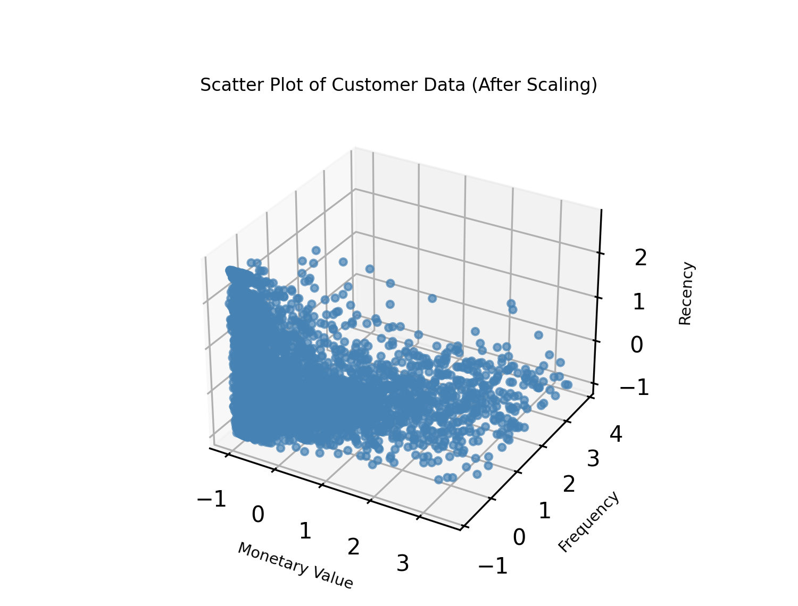
```

**Nhận xét**

Biểu đồ thể hiện mối quan hệ giữa ba chỉ số RFM (**Recency**, **Frequency**, **Monetary Value**) sau khi được chuẩn hóa cho ta thấy:

  - Phần lớn khách hàng tập trung ở vùng có **Recency** và **Frequency** **thấp**, cùng với giá trị chi tiêu (**Monetary**) ở mức **dưới trung bình**. Điều này phản ánh tập khách hàng phổ biến là những người mua hàng ít, không thường xuyên và đã không giao dịch gần đây. Một số điểm phân tán ở vùng **Recency thấp** - **Frequency** và **Monetary** cao cho thấy sự tồn tại của nhóm khách hàng **tích cực**, nhưng số lượng không nhiều. Sau khi chuẩn hóa, dữ liệu được phân bố rõ ràng và cân bằng, hỗ trợ tốt cho quá trình phân cụm tiếp theo.
  
\newpage
  
# **CHƯƠNG 4: KẾT QUẢ THỰC NGHIỆM** 

## **4.1. Phân cụm dữ liệu** 

Phân cụm là kỹ thuật giúp nhóm các đối tượng dữ liệu dựa trên sự tương đồng, hỗ trợ khám phá cấu trúc ẩn và hành vi đặc trưng. Trong bài này, chúng tôi sử dụng thuật toán **K-Means** để phân nhóm khách hàng theo hành vi tiêu dùng.

### *4.1.1. Chọn số lượng cụm tối ưu (k) trong phân cụm K-Means*

Xác định số lượng cụm **(k)** phù hợp là một bước quan trọng trong quá trình phân cụm **K-Means**.

Việc chọn đúng giá trị **k** giúp mô hình phân cụm hiệu quả, phản ánh đúng cấu trúc **tiềm ẩn** trong dữ liệu. 

Dưới đây chúng tôi sử dụng bốn phương pháp để tìm số lượng cụm **k** tối ưu cho thuật toán bao gồm:

  - **Phương pháp Elbow**
  
  - **Phương pháp Silhouette Score **
  
  - **Calinski-Harabasz Index**
  
  - **Davies-Bouldin Index**

```{python include=FALSE}
from sklearn.cluster import KMeans
```

```{python include=FALSE}
max_k = 15
inertia = []
silhoutte_scores = []
```

```{python include=FALSE}
from sklearn.metrics import silhouette_score, calinski_harabasz_score, davies_bouldin_score
import matplotlib.pyplot as plt
from sklearn.cluster import KMeans
# Khoi tao danh sach luu ket qua
k_values = range(2, max_k + 1)
silhouette_scores = []
inertias = []
ch_scores = []
db_scores = []

for k in k_values:
    kmeans = KMeans(n_clusters=k, random_state=42, max_iter=1000)
    cluster_labels = kmeans.fit_predict(scaled_data_df)

    # Luu cac chi so danh gia
    silhouette_scores.append(silhouette_score(scaled_data_df, cluster_labels))
    inertias.append(kmeans.inertia_)
    ch_scores.append(calinski_harabasz_score(scaled_data_df, cluster_labels))
    db_scores.append(davies_bouldin_score(scaled_data_df, cluster_labels))
```


```{python echo=FALSE, results='hide', message=FALSE, warning=FALSE}
import matplotlib.pyplot as plt
import seaborn as sns
sns.set(style="whitegrid", context="notebook", font_scale=1.1)

fig, axes = plt.subplots(2, 2, figsize=(18, 12))

# --- Elbow Method ---
axes[0, 0].plot(k_values, inertias, marker='o', color='dodgerblue')
axes[0, 0].set_title('Elbow Method (Inertia)', fontsize=30)
axes[0, 0].set_xlabel('Number of Clusters (k)', fontsize=30)
axes[0, 0].set_ylabel('Inertia', fontsize=30)
axes[0, 0].tick_params(labelsize=20)
axes[0, 0].grid(True)

# --- Silhouette Score ---
axes[0, 1].plot(k_values, silhouette_scores, marker='o', color='orange')
axes[0, 1].set_title('Silhouette Score', fontsize=30)
axes[0, 1].set_xlabel('Number of Clusters (k)', fontsize=30)
axes[0, 1].set_ylabel('Silhouette Score', fontsize=30)
axes[0, 1].tick_params(labelsize=20)
axes[0, 1].grid(True)

# --- Calinski-Harabasz Index ---
axes[1, 0].plot(k_values, ch_scores, marker='o', color='green')
axes[1, 0].set_title('Calinski-Harabasz Index', fontsize=30)
axes[1, 0].set_xlabel('Number of Clusters (k)', fontsize=30)
axes[1, 0].set_ylabel('CH Score', fontsize=30)
axes[1, 0].tick_params(labelsize=20)
axes[1, 0].grid(True)

# --- Davies-Bouldin Index ---
axes[1, 1].plot(k_values, db_scores, marker='o', color='red')
axes[1, 1].set_title('Davies-Bouldin Index (lower is better)', fontsize=30)
axes[1, 1].set_xlabel('Number of Clusters (k)', fontsize=30)
axes[1, 1].set_ylabel('DB Score', fontsize=30)
axes[1, 1].tick_params(labelsize=20)
axes[1, 1].grid(True)

plt.tight_layout()
plt.subplots_adjust(hspace=0.5, wspace=0.5)
plt.show()
```

Áp dụng 4 phương pháp **Elbow**, **Silhouette Score**, **Calinski-Harabasz Index** và **Davies-Bouldin Index** từ kết quả thu được chúng tôi đưa ra kết luận sau:

  - **Biểu đồ Elbow:** Điểm gấp khúc (Elbow) rõ ràng xuất hiện tại **k = 3** hoặc **k = 4**. Sau điểm này, mức giảm **inertia** không còn đáng kể.

  - **Biểu đồ Silhouette Score:** Điểm cao nhất là tại **k = 3** (**~0.46**), cho thấy cấu trúc phân cụm tốt nhất ở đây.

  - **Biểu đồ Calinski-Harabasz Index:** Điểm cao nhất, cho thấy cấu trúc tốt nhất là **k = 3**,

  - **Biểu đồ  Davies-Bouldin Index:** Điểm thấp nhất, chỉ ra cấu trúc phân cụm tốt nhất (vì giá trị thấp hơn là tốt hơn), là tại **k = 3**.

**Kết luận:** Từ 4 phương pháp xác định **k** ở trên thì đã tìm được số k phù hợp đó chính là **k = 3**.

### *4.1.2. Huấn luyện mô hình phân cụm bằng K-Means*

Sau khi xác định được số cụm tối ưu, mô hình **K-Means** được huấn luyện nhằm phân chia tập dữ liệu thành các nhóm khách hàng có đặc điểm **tương đồng**. Mỗi khách hàng được gán vào một cụm sao cho khoảng cách đến tâm cụm là **nhỏ nhất**.
  
Quá trình huấn luyện được **lặp lại** để tối ưu vị trí các tâm cụm, đảm bảo mô hình **ổn định** và kết quả phân cụm có **ý nghĩa**. Chỉ số **Silhouette** được sử dụng để đánh giá mức độ **phân tách** và tính **chặt chẽ** của các cụm.

```{python include=FALSE}
# khoi tao model
kmeans = KMeans(n_clusters=3, random_state=42, max_iter=1000)

cluster_labels = kmeans.fit_predict(scaled_data_df)

cluster_labels
```

```{python include=FALSE}
# them nhan vao df
non_outliers_df.loc[:, "Cluster"] = cluster_labels

non_outliers_df
```

```{python echo=FALSE, results='hide', message=FALSE, warning=FALSE}
from sklearn.metrics import silhouette_samples, silhouette_score
import matplotlib.pyplot as plt
import numpy as np
import seaborn as sns

# Lay nhan cum tu dataframe (dam bao la 1D array)
cluster_labels = non_outliers_df["Cluster"] #.to_numpy()

# Tinh chi so silhouette cho tung diem
silhouette_vals = silhouette_samples(scaled_data_df, cluster_labels)

# Tinh chi so silhouette trung binh
silhouette_avg = silhouette_score(scaled_data_df, cluster_labels)
print(f"Silhouette Score trung binh: {silhouette_avg:.3f}")

# Tinh silhouette trung binh cho tung cum
n_clusters = len(np.unique(cluster_labels))
silhouette_per_cluster = []

for i in range(n_clusters):
    cluster_silhouette = silhouette_vals[cluster_labels == i]
    silhouette_per_cluster.append(np.mean(cluster_silhouette))

# Ve bieu do
plt.figure(figsize=(4, 2.5))
sns.barplot(x=list(range(n_clusters)), y=silhouette_per_cluster, palette='viridis')
plt.axhline(y=silhouette_avg, color='red', linestyle='--', label='Silhouette trung binh')
plt.xlabel('Cluster', fontsize=9)
plt.ylabel('Gia tri Silhouette trung binh', fontsize=9)
plt.title('Chi so Silhouette cua tung cum', fontsize=9)
plt.legend(fontsize=8)
plt.tight_layout()
plt.show()
```

**Nhận xét**

Giá trị **Silhouette** trung bình đạt **0.45**, cho thấy mô hình phân cụm có chất lượng khá tốt. Các cụm được phân tách tương đối rõ ràng, mặc dù vẫn có một số điểm gần ranh giới giữa các cụm.

  - **Cụm 0** *(xanh dương)*: Giá trị Silhouette khoảng **0.45**, bằng với trung bình. Cụm này có chất lượng phân cụm tốt, các điểm đồng nhất cao và cách xa các cụm khác.

  - **Cụm 1** *(xanh lá)*: Cũng có Silhouette khoảng **0.45**, cho thấy chất lượng phân cụm tốt tương tự cụm 0.

  - **Cụm 2** *(xanh lục)*: Giá trị Silhouette thấp hơn (**~0.35**), phản ánh sự phân cụm kém hơn. Một số điểm có thể nằm gần ranh giới với các cụm khác.

## **4.2. Phân tích kết quả**

### *4.2.1. Trực quan hóa và phân tích kết quả phân cụm*

Sau khi hoàn thành quá trình huấn luyện mô hình **K-Means** và xác định được các cụm khách hàng, bước tiếp theo là trực quan hóa và phân tích kết quả phân cụm. Việc trực quan hóa giúp chúng ta quan sát được sự phân bố của các cụm trong không gian đặc trưng, từ đó đánh giá mức độ **tách biệt** và **đồng nhất** của các cụm.

**Kết quả phân cụm RFM trên môi trường 3D:**

Trước hết, biểu đồ phân tán 3D cung cấp cái nhìn toàn cảnh về cấu trúc không gian của dữ liệu khách hàng sau khi được phân cụm.

```{python echo=FALSE, results='hide', message=FALSE, warning=FALSE}
import matplotlib.pyplot as plt
from mpl_toolkits.mplot3d import Axes3D
from matplotlib.lines import Line2D

# Mau theo cum
cluster_colors = {
    0: '#1f77b4',  # xanh
    1: '#ff7f0e',  # cam
    2: '#2ca02c',  # xanh la
}
colors = non_outliers_df['Cluster'].map(cluster_colors)

# Tao figure
fig = plt.figure(figsize=(5, 3.8))
ax = fig.add_subplot(projection='3d')

# Ve scatter 3D theo cum
scatter = ax.scatter(
    non_outliers_df['MonetaryValue'],
    non_outliers_df['Frequency'],
    non_outliers_df['Recency'],
    c=colors,
    s=15,
    alpha=0.8,
    edgecolors='w',
    linewidth=0.2
)

# Gan nhan truc va tieu de
ax.set_xlabel('Monetary Value')
ax.set_ylabel('Frequency')
ax.set_zlabel('Recency')
ax.set_title('Scatter Plot of Customer Segments', pad=20)
ax.tick_params(labelsize=10)

# Xoay goc nhin cho ro hon
ax.view_init(elev=30, azim=-60)

# Tạo chu thich (legend)
legend_elements = [
    Line2D([0], [0], marker='o', color='w', label='Cluster 0', markerfacecolor=cluster_colors[0], markersize=8),
    Line2D([0], [0], marker='o', color='w', label='Cluster 1', markerfacecolor=cluster_colors[1], markersize=8),
    Line2D([0], [0], marker='o', color='w', label='Cluster 2', markerfacecolor=cluster_colors[2], markersize=8),
]
ax.legend(handles=legend_elements, loc='best')

plt.tight_layout(rect=[0, 0, 1, 0.95])
plt.show()
plt.close()
```

**Nhận xét**

  - Dữ liệu được phân cụm khá rõ ràng, thể hiện sự phân tách tốt giữa các nhóm. Điều này cho thấy thuật toán **K-Means** hoạt động hiệu quả, cả trong không gian dữ liệu nhiều chiều.

  - **Cụm 0** *(xanh dương)*: Có **Monetary Value thấp (0–1000)** và **Frequency thấp (0–4)** → Nhóm khách hàng có giá trị giao dịch nhỏ và ít mua sắm.

  - **Cụm 1** *(cam)*: Có **Monetary trung bình đến cao (1000–3500)**, **Frequency thấp** → Nhóm khách hàng có giá trị đơn hàng cao nhưng không mua thường xuyên.

  - **Cụm 2** *(xanh lá)*: Có **Frequency cao (4–10)** và **Monetary trung bình (1000–2500)** → Nhóm khách hàng trung thành, mua hàng đều và giá trị tương đối cao.

Phân cụm cho thấy sự phân biệt rõ ràng giữa các nhóm dựa trên hành vi tiêu dùng.

**Kết luận**

- Kết quả phân cụm đã chia khách hàng thành 3 nhóm với đặc trưng hành vi rõ rệt.

- Trong đó, nhóm **Cluster 2** là nhóm khách hàng tiềm năng nhất với tần suất và giá trị giao dịch cao, gần đây.

- Ngược lại, nhóm **Cluster 0** có mức độ tương tác thấp, ít giá trị có thể cần chiến lược thu hút hoặc loại bỏ.

### *4.2.2. Phân cụm bằng t-SNE*

```{python include=FALSE}
def kmeans(normalised_df_rfm, clusters_number, original_df_rfm):
    
    kmeans = KMeans(n_clusters = clusters_number, random_state = 1)
    kmeans.fit(normalised_df_rfm)

    # Extract cluster labels
    cluster_labels = kmeans.labels_
        
    # Create a cluster label column in original dataset
    df_new = original_df_rfm.assign(Cluster = cluster_labels)
    
    # Initialise TSNE
    model = TSNE(random_state=1)
    transformed = model.fit_transform(df_new)
    
    # Plot t-SNE
    plt.title('Flattened Graph of {} Clusters'.format(clusters_number))
    sns.scatterplot(x=transformed[:,0], y=transformed[:,1], hue=cluster_labels, style=cluster_labels, palette="Set1")
    
    return df_new
```

```{python message=FALSE, warning=FALSE, include=FALSE, results='hide'}
from sklearn.manifold import TSNE
from sklearn.cluster import KMeans
import matplotlib.pyplot as plt
from matplotlib.lines import Line2D

#
tsne = TSNE(n_components=2, random_state=42)
tsne_result = tsne.fit_transform(scaled_data_df)

# 
tsne_df = non_outliers_df.copy().reset_index(drop=True)
tsne_df['x'] = tsne_result[:, 0]
tsne_df['y'] = tsne_result[:, 1]

# 
fig, axes = plt.subplots(1, 2, figsize=(8, 3.2))  

#
kmeans3 = KMeans(n_clusters=3, random_state=42)
tsne_df['Cluster3'] = kmeans3.fit_predict(scaled_data_df)
colors3 = tsne_df['Cluster3'].map({0: 'red', 1: 'blue', 2: 'green'})

axes[0].scatter(tsne_df['x'], tsne_df['y'],
                c=colors3, s=20, alpha=0.7, edgecolors='white', linewidth=0.5)
axes[0].set_title('t-SNE with 3 Clusters', fontsize=11)
axes[0].set_xlabel('t-SNE Dim 1', fontsize=9)
axes[0].set_ylabel('t-SNE Dim 2', fontsize=9)
axes[0].tick_params(labelsize=8)
axes[0].grid(True, linestyle='--', alpha=0.4)

#
legend3 = [
    Line2D([0], [0], marker='o', color='w', label='Cluster 0', markerfacecolor='red', markersize=6),
    Line2D([0], [0], marker='o', color='w', label='Cluster 1', markerfacecolor='blue', markersize=6),
    Line2D([0], [0], marker='o', color='w', label='Cluster 2', markerfacecolor='green', markersize=6),
]
axes[0].legend(handles=legend3, title='Clusters', fontsize=6, title_fontsize=7,
               loc='best', markerscale=0.6, borderpad=0.3, labelspacing=0.2, handletextpad=0.4)

# 
kmeans4 = KMeans(n_clusters=4, random_state=42)
tsne_df['Cluster4'] = kmeans4.fit_predict(scaled_data_df)
colors4 = tsne_df['Cluster4'].map({0: 'red', 1: 'blue', 2: 'green', 3: 'purple'})

axes[1].scatter(tsne_df['x'], tsne_df['y'],
                c=colors4, s=20, alpha=0.7, edgecolors='white', linewidth=0.5)
axes[1].set_title('t-SNE with 4 Clusters', fontsize=11)
axes[1].set_xlabel('t-SNE Dim 1', fontsize=9)
axes[1].set_ylabel('t-SNE Dim 2', fontsize=9)
axes[1].tick_params(labelsize=8)
axes[1].grid(True, linestyle='--', alpha=0.4)

# 
legend4 = [
    Line2D([0], [0], marker='o', color='w', label='Cluster 0', markerfacecolor='red', markersize=6),
    Line2D([0], [0], marker='o', color='w', label='Cluster 1', markerfacecolor='blue', markersize=6),
    Line2D([0], [0], marker='o', color='w', label='Cluster 2', markerfacecolor='green', markersize=6),
    Line2D([0], [0], marker='o', color='w', label='Cluster 3', markerfacecolor='purple', markersize=6),
]
axes[1].legend(handles=legend4, title='Clusters', fontsize=6, title_fontsize=7,
               loc='best', markerscale=0.6, borderpad=0.3, labelspacing=0.2, handletextpad=0.4)

# 
plt.tight_layout()
plt.savefig("tsne_clusters.png", dpi=300)
plt.close()
```

```{r step20, echo=FALSE, fig.align='center', out.width='90%', fig.pos='H'}
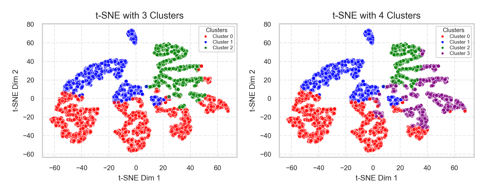
```

**Nhận xét**

Hai biểu đồ t-SNE thể hiện kết quả trực quan hoá phân cụm khách hàng theo **3** và **4** cụm. Ở mô hình **3 cụm**, các nhóm được phân tách rõ ràng, phản ánh sự khác biệt cơ bản về hành vi mua sắm. **Cụm 0 (xanh dương)** và **cụm 1 (đỏ)** có sự chồng lấn nhẹ, trong khi **cụm 2 (xanh lá)** nằm biệt lập hơn, cho thấy nhóm khách hàng có hành vi đặc trưng.

Khi tăng lên **4 cụm**, dữ liệu được phân chia chi tiết hơn, trong đó **cụm 3 (tím)** tách ra từ **cụm 2 cũ**, giúp làm rõ thêm một nhóm khách hàng tiềm năng. Dù có một số vùng giao thoa, cách phân cụm này phù hợp hơn cho mục tiêu cá nhân hóa chiến lược marketing.

Tóm lại, mô hình 3 cụm cho cái nhìn **tổng quan** rõ ràng, còn mô hình 4 cụm thích hợp cho phân tích **chuyên sâu** và triển khai các chiến dịch **tiếp cận** theo từng nhóm nhỏ.

### *4.2.3. Trực quan kết quả phân cụm các nhóm khách hàng bằng biểu đồ Violin*

```{python echo=FALSE, results='hide', message=FALSE, warning=FALSE}
import matplotlib.pyplot as plt
import seaborn as sns

non_outliers_df = non_outliers_df.copy()
non_outliers_df['Cluster'] = non_outliers_df['Cluster'].astype(int)


cluster_colors = {
    '0': '#1f77b4',  
    '1': '#2ca02c', 
    '2': '#d62728',  
}

sns.set(style="whitegrid")

#
fig, axes = plt.subplots(1, 3, figsize=(11.5, 3)) 
order = ["0", "1", "2"]

# 
sns.violinplot(
    data=non_outliers_df,
    x="Cluster", y="MonetaryValue",
    palette=cluster_colors,
    inner="quartile",
    ax=axes[0]
)
axes[0].set_title("Monetary Value by Cluster", fontsize=11)
axes[0].set_xlabel("")
axes[0].set_ylabel("Monetary Value")

# 
sns.violinplot(
    data=non_outliers_df,
    x="Cluster", y="Frequency",
    palette=cluster_colors,
    inner="quartile",
    ax=axes[1]
)
axes[1].set_title("Frequency by Cluster", fontsize=11)
axes[1].set_xlabel("")
axes[1].set_ylabel("Frequency")

# 
sns.violinplot(
    data=non_outliers_df,
    x="Cluster", y="Recency",
    palette=cluster_colors,
    inner="quartile",
    ax=axes[2]
)
axes[2].set_title("Recency by Cluster", fontsize=11)
axes[2].set_xlabel("Cluster")
axes[2].set_ylabel("Recency")

# 
plt.tight_layout()
plt.show()
plt.close()
```

**Nhận xét**

Ba biểu đồ cho thấy sự khác biệt rõ rệt giữa các cụm khách hàng theo từng tiêu chí của mô hình RFM:

- **Monetary Value:** **Cụm 2** có giá trị chi tiêu **cao nhất**, phân bố rộng và đồng đều, cho thấy đây là nhóm khách hàng **giá trị**. **Cụm 0** có mức chi tiêu **trung bình**, còn **cụm 1** chi tiêu **thấp nhất**.

- **Frequency:** **Cụm 2** cũng là nhóm mua hàng thường xuyên nhất, cho thấy mức độ gắn bó cao. Ngược lại, **cụm 1** có tần suất **mua thấp**, thể hiện mức độ **tương tác thấp** với doanh nghiệp.

- **Recency:** **Cụm 2** có thời gian mua **gần nhất**, trong khi **cụm 1** có thời gian mua **xa nhất**, cho thấy **cụm 2** là nhóm khách hàng hiện đang hoạt động **tích cực**, còn **cụm 1** có dấu hiệu **rời rạc** hoặc **ngưng tương tác**.

Từ kết quả này, có thể xác định **cụm 2** là nhóm khách hàng **tiềm năng nhất** để duy trì và chăm sóc, trong khi **cụm 1** cần có chiến lược **tái kích hoạt** phù hợp.

```{python include=FALSE}
non_outliers_df['Cluster'].value_counts()
```

### *4.2.4. Phân loại các nhóm ngoại lai theo 2 chỉ số (Monetary) và (Frequency)*

Nhóm tiến hành xác định các điểm ngoại lệ **(outliers)** theo hai tiêu chí là `Monetary` và `Frequency`. Sau đó, các outlier được chia thành ba nhóm riêng biệt:

  - Những khách hàng chỉ là **Outlier** theo **Monetary.**
  
  - Những khách hàng chỉ là **Outlier** theo **Frequency.**
  
  - Những khách hàng đồng thời là **Outlier** ở cả hai tiêu chí trên.

```{python include=FALSE}
# outliers by Monetary Value and Frequency
overlap_indices = monetary_outliers_df.index.intersection(frequency_outliers_df.index)

monetary_only_outliers = monetary_outliers_df.drop(overlap_indices)
frequency_only_outliers = frequency_outliers_df.drop(overlap_indices)
monetary_and_frequency_outliers = monetary_outliers_df.loc[overlap_indices]
# phan cac gia trịi outlier thanh 3 nhom 
monetary_only_outliers["Cluster"] = -1
frequency_only_outliers["Cluster"] = -2
monetary_and_frequency_outliers["Cluster"] = -3
# gop thanh df
outlier_clusters_df = pd.concat([monetary_only_outliers, frequency_only_outliers, monetary_and_frequency_outliers])

outlier_clusters_df
```

### *4.2.5. Trực quan kết quả phân cụm các nhóm khách hàng ngoại lai*

**Biểu đồ phân bố chi tiêu (Monetary Value) của các nhóm khách hàng ngoại lai**

```{python echo=FALSE, results='hide', message=FALSE, warning=FALSE}
import matplotlib.pyplot as plt
import seaborn as sns

# 
outlier_clusters_df = outlier_clusters_df.copy()
outlier_clusters_df['Cluster'] = outlier_clusters_df['Cluster'].astype(str)

# 
cluster_colors_outlier = {
    '-1': '#9467bd',  
    '-2': '#8c564b', 
    '-3': '#e377c2' 
}

# 
order_outliers = ['-1', '-2', '-3']

sns.set(style="whitegrid")
fig, axes = plt.subplots(1, 3, figsize=(11.5, 3))

# Monetary
sns.violinplot(
    data=outlier_clusters_df,
    x="Cluster", y="MonetaryValue",
    palette=cluster_colors_outlier,
    inner="quartile",
    order=order_outliers,
    ax=axes[0]
)
axes[0].set_title("Monetary Value by Cluster (Outliers)", fontsize=11)
axes[0].set_xlabel("")
axes[0].set_ylabel("Monetary Value")

# Frequency
sns.violinplot(
    data=outlier_clusters_df,
    x="Cluster", y="Frequency",
    palette=cluster_colors_outlier,
    inner="quartile",
    order=order_outliers,
    ax=axes[1]
)
axes[1].set_title("Frequency by Cluster (Outliers)", fontsize=11)
axes[1].set_xlabel("")
axes[1].set_ylabel("Frequency")

# Recency
sns.violinplot(
    data=outlier_clusters_df,
    x="Cluster", y="Recency",
    palette=cluster_colors_outlier,
    inner="quartile",
    order=order_outliers,
    ax=axes[2]
)
axes[2].set_title("Recency by Cluster (Outliers)", fontsize=11)
axes[2].set_xlabel("Cluster")
axes[2].set_ylabel("Recency")

plt.tight_layout()
plt.show()
```

**Nhận xét**

Ba biểu đồ cho thấy sự khác biệt rõ rệt giữa các cụm khách hàng ngoại lai theo từng chỉ số RFM:

- **Monetary Value:** **Cụm -3** có mức chi tiêu **cao nhất**, với nhiều giá trị vượt trội lên đến hơn **300,000**, phản ánh nhóm khách hàng có sức mua lớn nhưng không phổ biến. **Cụm -1** và **Cụm -2** có chi tiêu **thấp hơn đáng kể**.

- **Frequency:** Tương tự, **cụm -3** cũng là nhóm có tần suất mua hàng **cao nhất**, thậm chí vượt ngưỡng **200 lần**, cho thấy mức độ tương tác dày đặc. **Cụm -1** và **Cụm -2** có tần suất **thấp** và phân bố **hẹp hơn**.

- **Recency:** **Cụm -3** tiếp tục có chỉ số **Recency** **thấp nhất** (**giao dịch gần đây**), trong khi **cụm -2** có thời gian **mua xa hơn**, cho thấy mức độ tương tác đã **giảm**. **Cụm -1** có mức **Recency trung bình**.

Nhìn chung, cụm -3 đại diện cho nhóm khách hàng ngoại lệ giàu tiềm năng, có giá trị cao và cần được quản lý riêng biệt. Cụm -1 và -2 tuy không vượt trội về giá trị nhưng có thể là nhóm khách hàng cần theo dõi để đánh giá khả năng tái kích hoạt hoặc sàng lọc.

## **4.3. Đề xuất chiến lược phù hợp cho các nhóm khách hàng**

### *4.3.1. Đề xuất chiến lược cho các nhóm chính*

Dựa trên phân tích trực quan ba chỉ số RFM, ba cụm khách hàng chính thể hiện những đặc điểm hành vi tiêu dùng rõ rệt, từ đó làm cơ sở cho việc đề xuất chiến lược tiếp cận phù hợp như sau:

- **Cluster 0:** Nhóm khách hàng tiềm năng, cần được nuôi dưỡng.

  - **Chiến lược đề xuất:**

    - Khuyến khích mua lại bằng **mã giảm giá**, **ưu đãi combo**, hoặc chương trình **“mua 3 tặng 1”**.

    - Sử dụng email để **remarketing** nhắc nhở sản phẩm, gợi ý sản phẩm mới.

    - Tăng tương tác bằng cách mời tham gia **mini game**, **khảo sát trúng thưởng** hoặc **chương           trình giới thiệu bạn bè**.

- **Cluster 1:** Nhóm khách hàng có khả năng rời bỏ hoặc ít giá trị.

  - **Chiến lược đề xuất:**

    - Triển khai chiến dịch kích hoạt lại **(re-engagement)** qua email hoặc **tin nhắn cá nhân hóa**.

    - Đề xuất các sản phẩm **giá thấp**, **rủi ro mua thấp** để khuyến khích hành vi mua lại.

    - Nếu không có phản hồi trong thời gian dài, có thể cân nhắc chuyển sang nhóm **bị động**, ưu tiên
    tập trung nguồn lực cho nhóm khách hàng tiềm năng hơn.

- **Cluster 2:** Nhóm khách hàng giá trị cao, trung thành.

  - **Chiến lược đề xuất:**

    - Duy trì mối quan hệ **bền vững** bằng các chương trình khách hàng **thân thiết** hoặc **hạng thành     viên cao cấp**.

    - Gửi ưu đãi cá nhân hóa dựa trên lịch sử mua hàng và hành vi trước đó.

    - Tạo cảm giác được **trân trọng** bằng các hoạt động như **tri ân theo quý**, **tặng quà sinh           nhật**, hoặc **ưu tiên hỗ trợ**.
    
### *4.3.2. Đề xuất chiến lược cho các nhóm ngoại lai*

Dựa trên phân tích trực quan các chỉ số RFM, ba nhóm khách hàng ngoại lai **(-1, -2, -3)** thể hiện những hành vi tiêu dùng **khác biệt** rõ rệt so với các cụm khách hàng chính. Những nhóm này cần được đánh giá riêng và xây dựng chiến lược chăm sóc hoặc xử lý phù hợp nhằm tận dụng tối đa giá trị hoặc hạn chế ảnh hưởng bất thường đến phân tích tổng thể.

- **Cluster -1:** Ngoại lai theo **Monetary**

  - **Chiến lược đề xuất:**

    - Xác minh tính **hợp lệ** của các đơn hàng để loại trừ giao dịch **bất thường**.

    - Nếu là khách thật: Phân loại thành nhóm khách giá trị **lớn** một lần, gợi ý mua tiếp sản phẩm tương tự với **ưu đãi cao cấp**.

    - Ưu tiên xây dựng mối quan hệ **dài hạn**, khuyến khích mua lặp lại với chính sách chăm sóc       **chuyên biệt**.

- **Cluster -2:** Ngoại lai theo **Frequency**

  - **Chiến lược đề xuất:**

    - Tăng giá trị đơn hàng trung bình bằng **combo ưu đãi**, **mã giảm giá** theo mốc chi tiêu.

    - Nếu là hành vi hợp lệ: Nuôi dưỡng nhóm khách hàng nhỏ thường xuyên bằng **tích điểm**.

    - Nếu nghi ngờ **"spam"** đơn hàng: cần theo dõi và lọc tài khoản không hợp lệ.

- **Cluster -3:** Ngoại lai theo cả **Monetary** và **Frequency**

  - **Chiến lược đề xuất:**

    - Phân tách và kiểm tra dữ liệu kỹ lưỡng: Nhóm này có thể vừa là **khách VIP**, vừa là giao dịch **bất thường**.

    - Nếu xác định là khách chiến lược: Cần thiết lập gói **chăm sóc riêng**, **hotline riêng**, **hợp đồng định kỳ**.

    - Nếu khách hàng thuộc nhóm doanh nghiệp hoặc mua hàng với số lượng lớn, có thể xem xét áp dụng hình thức **bán sỉ** hoặc **ký kết hợp đồng dài hạn**.

**Kết luận**

Việc xử lý và phân tích riêng nhóm khách hàng ngoại lai giúp nâng cao chất lượng phân cụm, đồng thời hỗ trợ doanh nghiệp xây dựng các chương trình chăm sóc riêng biệt, phù hợp với hành vi tiêu dùng bất thường nhưng tiềm năng cao.

## **4.4. Gán nhãn và trình bày kết quả phân cụm khách hàng**

### *4.4.1 Tiến hành gán nhãn chiến lược cho các cụm*

Sau khi phân cụm, nhóm tiến hành gắn nhãn cho từng nhóm khách hàng dựa trên đặc điểm hành vi mua sắm và mục tiêu chiến lược. Cụ thể:

  - **Cụm 0 – “NUR”**: Khách hàng tiềm năng, cần được chăm sóc để gia tăng giá trị lâu dài.

  - **Cụm 1 – “RE”**: Khách hàng có nguy cơ rời bỏ, cần được tương tác lại để giữ chân.

  - **Cụm 2 – “REW”**: Khách hàng trung thành, nên được tri ân và duy trì mối quan hệ bền vững.

  - **Cụm -3 – “PAM”**: Khách VIP, cần được ưu ái với các dịch vụ và chính sách đặc biệt.

  - **Cụm -2 – “UPS”**: Khách hàng mới, có thể được đề xuất thêm sản phẩm hoặc dịch vụ.

  - **Cụm -1 – “DEL”**: Nhóm khách trung thành nhưng có giá trị chi tiêu thấp, cần tạo trải nghiệm xuất sắc để nâng cao sự hài lòng.

Việc gắn nhãn giúp định hướng rõ chiến lược tiếp cận và chăm sóc phù hợp cho từng nhóm khách hàng sau phân cụm.

```{python include=FALSE}
# 2 - xanh la, khach hang trung thanh
# 1 - khach co kha nang roi bo
# 0 - khach tiem nang
# -3 - khach vip
# -2 nhom khach hang moi
# -1 nhom khach trung thanh nhung chi tieu it

cluster_labels = {
    0: "NUR",     # Cham soc khach hang tiem nang
    1: "RE",   # Tuong tac lai voi khach hang da roi di
    2: "REW",      # Thuong cho khach hang trung thanh
    -3: "PAM",     # Chieu chuong khach hang VIP
    -2: "UPS",     # De xuat mua them san pham/dich vu
    -1: "DEL"     # Tao trai nghiem xuat sac de lam hai long khach hang
}   
```

### *4.4.2 Tạo bảng dữ liệu phân cụm đầy đủ*

Sau khi đã thực hiện phân cụm và gắn nhãn chiến lược cho cả nhóm khách hàng chính và các nhóm ngoại lệ, nhóm tiến hành hợp nhất toàn bộ dữ liệu thành một bảng duy nhất, gọi là `full_clustering_df`. Bảng này bao gồm tất cả khách hàng với nhãn phân cụm đã được ánh xạ thành tên cụ thể tương ứng với chiến lược tiếp cận.

Kết quả phân bố khách hàng theo từng nhãn cụm như sau:

```{python echo=FALSE}
full_clustering_df = pd.concat([non_outliers_df, outlier_clusters_df])
full_clustering_df["Cluster"] = full_clustering_df["Cluster"].astype(int)
full_clustering_df["ClusterLabel"] = full_clustering_df["Cluster"].map(cluster_labels)
```

```{python echo=FALSE, results='asis'}
counts_df = full_clustering_df['ClusterLabel'].value_counts().reset_index()
counts_df.columns = ['ClusterLabel', 'Count']

md_table = "| ClusterLabel | Count |\n|---|---|\n"
for _, row in counts_df.iterrows():
    md_table += f"| {row['ClusterLabel']} | {row['Count']} |\n"

print(md_table)
```

### *4.4.3 Ánh xạ tên chiến lược cho từng cụm khách hàng*

Nhóm chúng tôi tiến hành ánh xạ nhãn chiến lược (**ClusterLabel**) cho từng cụm khách hàng đã phân nhóm, giúp dễ dàng theo dõi và trình bày kết quả.

```{python echo=FALSE}
# anh xa
full_clustering_df["ClusterLabel"] = full_clustering_df["Cluster"].map(cluster_labels)

```

```{python echo=FALSE, results='markup'}
print(full_clustering_df.sample(10))
```

### *4.4.4 Trực quan hóa phân bố khách hàng và giá trị trung bình theo cụm*

Biểu đồ kết hợp dưới đây minh họa số lượng khách hàng theo từng cụm (**Barplot**) và giá trị trung bình các chỉ số **Recency**, **Frequency**, **Monetary** (**đã chuẩn hóa**) trên cùng một biểu đồ (**lineplot**). Qua đó giúp đánh giá được quy mô cũng như đặc điểm nổi bật của từng nhóm khách hàng.

```{python echo=FALSE}
# 
cluster_counts = full_clustering_df['ClusterLabel'].value_counts()
full_clustering_df["MonetaryValue per 100 pounds"] = full_clustering_df["MonetaryValue"] / 100.00
# 
feature_means = full_clustering_df.groupby('ClusterLabel')[['Recency', 
                                                            'Frequency', 
                                                            'MonetaryValue per 100 pounds']].mean()

fig, ax1 = plt.subplots(figsize=(4, 4))

_=sns.barplot(x=cluster_counts.index, y=cluster_counts.values, ax=ax1, palette='viridis', hue=cluster_counts.index)
_=ax1.set_ylabel('Number of Customers', color='b', fontsize=9)
_=ax1.set_title('Cluster Distribution with Average Feature Values')

ax2 = ax1.twinx()

_=sns.lineplot(data=feature_means, ax=ax2, palette='Set2', marker='o')
_=ax2.set_ylabel('Average Value', color='g', fontsize=9)


plt.show()
```

**Nhận xét**

Biểu đồ thể hiện rõ sự khác biệt về quy mô và đặc điểm hành vi giữa các nhóm khách hàng:

- **NURTURE** là nhóm lớn nhất với hơn **2000 khách hàng**. Tuy nhiên, họ có giá trị chi tiêu (**Monetary**) và tần suất mua hàng (**Frequency**) ở mức thấp, dù **Recency** tương đối gần. Đây là nhóm tiềm năng, cần được nuôi dưỡng để gia tăng giá trị.

- **RE-ENGAGE** có số lượng khách trung bình nhưng lại có **Recency** rất cao, cho thấy họ đã lâu không mua hàng. Đồng thời, cả **Frequency** và **Monetary** đều thấp. Đây là nhóm có nguy cơ rời bỏ cao, cần các chiến dịch kích hoạt lại.

- **REWARD** là nhóm có chỉ số **Frequency** và **Monetary** cao nhất, và **Recency** thấp. Đây là nhóm khách trung thành và mang lại giá trị lớn, cần được duy trì và tri ân.

- **PAMPER** nổi bật với **Monetary** trung bình vượt trội dù tần suất không quá cao. Đây là nhóm VIP cần được cá nhân hóa trải nghiệm và chăm sóc đặc biệt.

- **DELIGHT** có chỉ số trung bình khá tốt, đặc biệt là **Recency** thấp và **Frequency** ổn định. Đây là nhóm khách hàng trung thành tiềm năng, nên tập trung vào duy trì lòng trung thành qua ưu đãi mềm.

- **UPSELL** là nhóm nhỏ nhất, nhưng có **Recency** rất thấp, Frequency ở mức trung bình. Đây là khách mới tiềm năng, nên tận dụng thời điểm này để giới thiệu thêm sản phẩm (**cross-sell**, **upsell**).


\newpage

# **CHƯƠNG 5: KẾT LUẬN VÀ KIẾN NGHỊ**

## **5.1. Kết luận**

Nghiên cứu đã ứng dụng thành công mô hình RFM kết hợp với thuật toán K-means để phân nhóm khách hàng, thu được 3 cụm chính gồm:

- **REWARD (khách hàng trung thành)**

- **RE-ENGAGE (nguy cơ rời bỏ)**

- **NURTURE (tiềm năng)**

Bên cạnh đó, phân tích thêm các ngoại lệ (**outliers**) đã xác định thêm 3 nhóm: **VIP (PAMPER)**, **mới (UPSELL)** và **đang suy giảm (DELIGHT)**.

Mô hình đạt hệ số **Silhouette ~0.45**, cho thấy phân cụm có độ phân tách tương đối rõ, hỗ trợ hiệu quả cho việc xây dựng chiến lược tiếp thị cá nhân hóa.

**Tuy nhiên, nghiên cứu vẫn còn hạn chế như:**

- Dữ liệu chỉ trong một năm, chưa phản ánh yếu tố mùa vụ

- Chưa tích hợp nhân khẩu học, tâm lý khách hàng

- Chưa so sánh với các mô hình phân cụm khác

## **5.2. Kiến nghị**

Để nâng cao hiệu quả và tính ứng dụng, nghiên cứu có thể mở rộng theo hướng:

- Áp dụng **RFM động** để theo dõi hành vi theo thời gian.

- Kết hợp với thuật toán khác như DBSCAN hoặc Hierarchical Clustering.

- Bổ sung dữ liệu nhân khẩu học để phân tích sâu hơn.

- Tích hợp dự đoán Customer Lifetime Value (LTV) để đánh giá tiềm năng khách hàng dài hạn.

Mô hình RFM–Kmeans là nền tảng hiệu quả để doanh nghiệp hiểu khách hàng, tối ưu hóa nguồn lực và xây dựng chiến lược chăm sóc phù hợp theo từng phân khúc.

\newpage

# **TÀI LIỆU THAM KHẢO**


