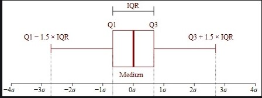
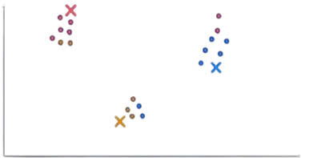

# **2. TỔNG QUAN LÝ THUYẾT**

## **2.1 Phân tích hành vi khách hàng và tầm quan trọng của phân khúc**

**Hành vi khách hàng** là toàn bộ quá trình suy nghĩ, ra quyết định và hành động của người tiêu dùng trong việc tiếp cận, mua và sử dụng sản phẩm hoặc dịch vụ. Việc thấu hiểu hành vi này giúp doanh nghiệp:

- Dự đoán chính xác nhu cầu thị trường

- Điều chỉnh chiến lược tiếp cận khách hàng

- Tối ưu hóa hiệu quả kinh doanh.

Trong thời đại dữ liệu số, phân tích hành vi không còn dựa vào quan sát trực tiếp mà chủ yếu dựa vào **phân tích dữ liệu lịch sử mua sắm** của khách hàng ([PACE, 2023](https://www.pace.edu.vn/tin-kho-tri-thuc/hanh-vi-khach-hang)).

**Phân khúc khách hàng (Customer Segmentation)** là quá trình chia nhỏ thị trường thành các nhóm khách hàng có đặc điểm tương đồng thường dựa trên hành vi tiêu dùng, nhu cầu, giá trị đơn hàng hoặc tần suất mua sắm. Mục tiêu của việc phân khúc là giúp doanh nghiệp:

- Xây dựng chiến lược tiếp thị mục tiêu

- Tối ưu chi phí marketing

- Nâng cao trải nghiệm khách hàng.

Theo khảo sát của **TechTarget**, doanh nghiệp áp dụng chiến lược phân khúc bài bản có thể **tăng tỷ lệ giữ chân khách hàng lên đến 30%** so với các doanh nghiệp không thực hiện phân khúc ([Base.vn, 2023](https://base.vn/blog/phan-khuc-khach-hang)).

Một số lợi ích cụ thể của phân khúc khách hàng:

- **Tập trung đúng đối tượng**: Tối ưu ngân sách, tăng hiệu quả tiếp thị.

- **Cá nhân hóa trải nghiệm**: Nâng cao sự hài lòng, tăng mức độ trung thành.

- **Mở rộng thị trường**: Tận dụng hiệu quả từ các phân khúc hiện tại để mở rộng ra tệp khách hàng mới.

### *2.1.1 Các hình thức phân khúc khách hàng*   


```{r step1, echo=FALSE, fig.align='center', out.width='100%', fig.cap="Các hình thức phân khúc khách hàng", fig.pos='H'}

```


Dưới đây là ba phương pháp tiếp cận phổ biến trong phân khúc khách hàng:

| Phương pháp       | Đặc điểm chính                                                                 | Ứng dụng                                     |
|-------------------|----------------------------------------------------------------------------------|-----------------------------------------------|
| **Persona-based** | Định tính, dựa trên hồ sơ khách hàng mẫu                                       | Dữ liệu hạn chế hoặc nghiên cứu sơ khởi       |
| **Behavior-based**| Định lượng, dựa vào dữ liệu hành vi thực tế (ví dụ: RFM)                      | Phân tích từ dữ liệu giao dịch                |
| **Predictive**    | Dự đoán xu hướng tương lai (như khả năng mua, rời bỏ, nhấp chuột)             | Dùng khi có dữ liệu lớn và mô hình dự đoán   |

Trong thực tế, tiếp cận phân khúc theo hành vi **(behavior-based segmentation)** bằng mô hình RFM là một phương pháp phổ biến, đặc biệt phù hợp khi có sẵn dữ liệu lịch sử giao dịch. Phương pháp này giúp nhóm khách hàng theo đặc điểm tiêu dùng thực tế dựa trên ba yếu tố: Recency (gần nhất), Frequency (tần suất mua hàng), và Monetary (giá trị chi tiêu).

## **2.2. Mô hình RFM**

Mô hình **RFM** (*Recency – Frequency – Monetary*) là một phương pháp phân tích hành vi khách hàng phổ biến trong các lĩnh vực như thương mại điện tử, ngân hàng, bán lẻ và tiếp thị trực tiếp. Dựa trên nguyên lý **Pareto (80/20)** cho rằng **20% khách hàng tạo ra 80% doanh số**, mô hình này giúp doanh nghiệp xác định nhóm khách hàng mang lại giá trị cao nhất, từ đó phân bổ nguồn lực phù hợp để tối ưu hóa hiệu quả kinh doanh.

```{r step2, echo=FALSE, fig.align='center', out.width='50%', fig.cap="Mô hình RFM", fig.pos='H'}

```


- **Recency (R)**: Thể hiện khoảng thời gian kể từ lần giao dịch gần nhất. Khách hàng có chỉ số Recency thấp thường vẫn còn tương tác tích cực với doanh nghiệp, trong khi giá trị cao có thể là tín hiệu cảnh báo về khả năng rời bỏ.

- **Frequency (F)**: Đo lường số lần mua hàng trong khoảng thời gian xác định. Tần suất cao thường đồng nghĩa với mức độ trung thành cao.

- **Monetary (M)**: Đại diện cho tổng giá trị chi tiêu. Đây là chỉ số quan trọng nhất phản ánh mức độ đóng góp thực tế của khách hàng vào doanh thu.

Các tổ chức lớn thường triển khai phân khúc khách hàng dựa trên các mức RFM khác nhau. Chẳng hạn, trong ngành ngân hàng, khách hàng có thể được phân thành các nhóm như *Mass*, *Affluent* và *Priority* để phục vụ theo từng cấp độ giá trị. Ở lĩnh vực chứng khoán, các nhóm khách hàng được chia theo tài sản ròng (*NAV*). Việc này không chỉ giúp tăng sự hài lòng mà còn tạo điều kiện để phát triển các sản phẩm/dịch vụ phù hợp với từng phân khúc.  
Nguồn: [phamdinhkhanh.github.io](https://phamdinhkhanh.github.io/2019/11/08/RFMModel.html#i-m%C3%B4-h%C3%ACnh-rfm-recency---frequency---monetary-model)

Trong các bài toán phân tích khách hàng, mô hình RFM thường được sử dụng như một công cụ **rút trích đặc trưng định lượng đầu vào** cho các thuật toán phân cụm như **K-Means**. Việc mã hóa mỗi khách hàng thông qua ba chỉ số **R, F và M** cho phép mô hình nhóm các cá nhân có hành vi tiêu dùng tương đồng một cách hiệu quả. Phương pháp này có tính khả thi cao, không yêu cầu dữ liệu nhạy cảm và đặc biệt phù hợp trong các bối cảnh thực tế cần phân khúc hành vi khách hàng.

### *2.2.1 Ưu điểm của RFM*

Mô hình RFM mang lại nhiều lợi ích trong phân tích hành vi khách hàng và tối ưu chiến lược tiếp thị. Theo **Harvard Business School**, việc tập trung vào nhóm khách hàng có giá trị cao có thể:**Tăng tỷ lệ chuyển đổi lên tới 750%**
và **Tăng doanh thu đến 300%**. Nguồn:[HBR,2004](https://hbr.org/2004/07/getting-the-most-out-of-all-your-customers)

Mô hình RFM hỗ trợ doanh nghiệp xác định các nhóm khách hàng trọng yếu như **Champions**, **Loyal Customers** hay **At-Risk Customers**, từ đó triển khai các chương trình giữ chân phù hợp.Nguồn: [Optimove](https://www.optimove.com/resources/learning-center/rfm-segmentation). Theo nghiên cứu của **Bain & Company**, chỉ cần tăng 5% tỷ lệ duy trì khách hàng cũng có thể mang lại mức tăng lợi nhuận từ 25% đến 95%.Nguồn: [HBR, 2014](https://hbr.org/2014/10/the-value-of-keeping-the-right-customers)

Nhờ khả năng **định lượng hành vi và giá trị khách hàng**, RFM tạo nền tảng vững chắc cho các chiến lược tiếp cận cá nhân hóa và xây dựng mối quan hệ dài hạn với khách hàng mục tiêu.  
Nguồn: [Bizfly](https://bizfly.vn/techblog/phan-tich-rfm-la-gi-phan-loai-khach-hang-theo-mo-hinh-rfm.html)

## **2.3. Chuẩn hóa dữ liệu (Standardization)**

Trong lĩnh vực học máy và khai thác dữ liệu, chuẩn hóa là một bước tiền xử lý có vai trò quan trọng, đặc biệt khi làm việc với dữ liệu có các đặc trưng đo lường trên các đơn vị hoặc khoảng giá trị khác nhau. Chuẩn hóa **(standardization)** giúp đưa các biến đầu vào về cùng một thang đo, qua đó tránh tình trạng một số đặc trưng có quy mô lớn hơn sẽ gây ảnh hưởng không cân xứng đến kết quả của thuật toán.

Trong các mô hình học sử dụng khoảng cách hoặc gradient, chẳng hạn như K-Means, PCA hay mạng nơ-ron, chuẩn hóa không chỉ giúp đảm bảo tính công bằng giữa các đặc trưng mà còn góp phần cải thiện độ chính xác và tốc độ huấn luyện mô hình. Về bản chất, chuẩn hóa không thay đổi mối quan hệ tương đối giữa các giá trị mà chỉ điều chỉnh chúng sao cho tương thích về mặt hình học và thống kê.

### *2.3.1. Cơ sở toán học của chuẩn hóa*

Phương pháp chuẩn hóa được sử dụng phổ biến nhất là chuẩn hóa theo phân phối chuẩn **(z-score normalization)**. Kỹ thuật này chuyển các giá trị của một đặc trưng về một thang đo mới có trung bình bằng 0 và độ lệch chuẩn bằng 1, theo công thức:

\[
z = \frac{x - \mu}{\sigma}
\]

Trong đó:

- \( x \): là giá trị gốc của một điểm dữ liệu.

- \( \mu \): là trung bình của toàn bộ đặc trưng đó.

- \( \sigma \): là độ lệch chuẩn tương ứng.

Việc chuẩn hóa theo **z-score** giúp tái định hình phân phối dữ liệu theo hướng loại bỏ ảnh hưởng của đơn vị đo lường và quy mô, qua đó tạo điều kiện thuận lợi cho các thuật toán phân tích hoạt động hiệu quả và ổn định hơn.

### *2.3.2. Lợi ích khi áp dụng chuẩn hóa*

Chuẩn hóa dữ liệu mang lại nhiều lợi thế trong quá trình xây dựng mô hình học máy:

- **Cân bằng ảnh hưởng giữa các đặc trưng**: Đảm bảo rằng không có biến nào chiếm ưu thế chỉ vì quy mô giá trị lớn hơn các biến khác.

- **Giảm sai số số học trong tính toán**: Giúp giảm thiểu các lỗi liên quan đến làm tròn hoặc độ chính xác máy tính trong các phép tính ma trận.

- **Tăng tốc độ hội tụ trong huấn luyện**: Đặc biệt quan trọng với các thuật toán tối ưu hóa gradient như SGD.

- **Hỗ trợ phân tích trực quan tốt hơn**: Việc dữ liệu nằm trong cùng một khoảng giá trị giúp biểu đồ và mô hình trực quan dễ đọc, dễ phân tích.

### *2.3.3. Hạn chế và điểm cần lưu ý*

Dù hữu ích, chuẩn hóa cũng tồn tại một số hạn chế:

- **Làm mất ý nghĩa thực tế của dữ liệu gốc**: Các giá trị sau chuẩn hóa không còn mang đơn vị gốc nên có thể gây khó khăn cho việc diễn giải trực tiếp.

- **Không cần thiết với một số thuật toán**: Các mô hình như cây quyết định, rừng ngẫu nhiên không phụ thuộc vào khoảng cách hay đạo hàm nên thường không yêu cầu chuẩn hóa.

- **Dễ bị nhiễu bởi ngoại lệ**: Vì sử dụng trung bình và độ lệch chuẩn, phương pháp z-score dễ bị ảnh hưởng nếu dữ liệu chứa nhiều điểm cực trị.

### *2.3.4. Vai trò trong các thuật toán học máy*

Chuẩn hóa thường được xem là một bước tiền xử lý bắt buộc trong các phương pháp học sử dụng:

- **Khoảng cách**: như K-Means, KNN – vì kết quả phụ thuộc trực tiếp vào độ dài vector.

- **Tối ưu đạo hàm**: như hồi quy tuyến tính, logistic hoặc deep learning – vì gradient dễ bị sai lệch nếu đặc trưng không cùng thang đo.

- **Giảm chiều**: như PCA – vì các phương sai không chuẩn hóa sẽ khiến các thành phần chính bị chi phối bởi biến có đơn vị lớn.

Chuẩn hóa dữ liệu là một bước lý thuyết nền tảng nhằm đảm bảo rằng mỗi đặc trưng đầu vào đóng góp một cách công bằng vào quá trình học, từ đó nâng cao hiệu quả của toàn bộ mô hình.  
([Nguồn tham khảo: Wikipedia - Feature Scaling](https://en.wikipedia.org/wiki/Feature_scaling))

## **2.4. Ngoại lệ trong dữ liệu và vai trò trong phân tích**

### *2.4.1. Khái niệm ngoại lệ (Outlier)*

Trong thống kê và phân tích dữ liệu, **(outlier)** là những điểm dữ liệu có giá trị lệch một cách bất thường so với phần lớn các điểm còn lại trong tập dữ liệu. Những điểm này có thể là kết quả của lỗi đo lường, lỗi nhập liệu, hoặc phản ánh một hành vi đặc biệt trong thực tế.

```{r step3, echo=FALSE, fig.align='center', out.width='50%', fig.cap="Minh họa về outlier", fig.pos='H'}

```

Tùy theo ngữ cảnh, **(outlier)** có thể chứa thông tin giá trị (ví dụ: khách hàng VIP chi tiêu cao bất thường) hoặc chỉ đơn thuần là nhiễu cần được loại bỏ.
([Nguồn: CareerFoundry](https://careerfoundry.com/en/blog/data-analytics/what-is-an-outlier/))

### *2.4.2. Tác động của ngoại lệ đến phân tích và mô hình học máy*

Sự tồn tại của các giá trị ngoại lệ có thể **làm sai lệch kết quả phân tích**, đặc biệt trong các mô hình dựa trên khoảng cách (K-Means, KNN) hoặc độ lệch trung bình. Ngoại lệ có thể:

- Làm lệch **trung tâm cụm (centroid)** trong phân cụm K-Means.

- Gây ra hiện tượng **mô hình học bị lệch hoặc quá khớp**.

- Làm sai số trong **ước lượng thống kê** như trung bình hoặc phương sai.

Do đó, nhận diện và xử lý ngoại lệ là bước cần thiết trong tiền xử lý dữ liệu.

### *2.4.3. Phương pháp phát hiện ngoại lệ*

Một kỹ thuật phổ biến trong thống kê mô tả để phát hiện ngoại lệ là **IQR (Interquartile Range)**, dựa trên các tứ phân vị:

```{r step4, echo=FALSE, fig.align='center', out.width='50%', fig.cap="Phát hiện giá trị ngoại lệ bằng phương pháp IQR (Interquartile Range).", fig.pos='H'}

```

\[
\text{IQR} = Q3 - Q1
\]
\[
\text{Outlier if } x < Q1 - 1.5 \times IQR \quad \text{or} \quad x > Q3 + 1.5 \times IQR
\]

Trong đó:

- \( Q1 \): tứ phân vị thứ nhất (25% dưới cùng).

- \( Q3 \): tứ phân vị thứ ba (75% dưới cùng).

- \( x \): giá trị quan sát.

Bên cạnh đó, các phương pháp khác như **z-score**, **Mahalanobis distance**, hoặc trực quan hóa bằng **boxplot**, **scatter plot** cũng được sử dụng trong thực hành phân tích dữ liệu.
([Nguồn: Analytics Vidhya](https://www.analyticsvidhya.com/blog/2021/05/detecting-and-treating-outliers-treating-the-odd-one-out/))

### *2.4.4. Ưu điểm và nhược điểm của việc xử lý ngoại lệ*

#### Ưu điểm:

- **Cải thiện độ chính xác mô hình**: Khi loại bỏ nhiễu, mô hình học máy phản ánh đúng hơn mối quan hệ trong dữ liệu.

- **Tăng độ ổn định và khả năng tổng quát**: Hạn chế ảnh hưởng tiêu cực từ các điểm quá khác biệt.

- **Hỗ trợ phát hiện hành vi đặc biệt**: Có thể sử dụng để phát hiện gian lận, khách hàng đặc biệt, hoặc bất thường trong sản xuất.

#### Nhược điểm:

- **Nguy cơ mất thông tin giá trị**: Một số ngoại lệ không phải lỗi mà phản ánh hành vi thật sự (ví dụ: khách hàng VIP).

- **Phụ thuộc vào ngữ cảnh và ngành**: Không có quy tắc chung cho việc giữ hay loại bỏ — quyết định xử lý cần dựa vào hiểu biết nghiệp vụ.

- **Một số phương pháp phát hiện phụ thuộc phân phối dữ liệu**: Ví dụ, z-score giả định dữ liệu phân phối chuẩn nên không phù hợp với phân phối lệch.

### *2.4.5. Vai trò của xử lý ngoại lệ trong quá trình phân tích*

Việc xử lý ngoại lệ là một phần quan trọng trong tiền xử lý dữ liệu. Đặc biệt trong các mô hình phân cụm như **K-Means**, việc giữ lại các điểm dữ liệu gây nhiễu có thể ảnh hưởng tiêu cực đến vị trí tâm cụm và kết quả phân nhóm. Bằng cách xác định và xử lý thích hợp các điểm ngoại lệ, nhà phân tích có thể:

- Cải thiện độ chính xác của mô hình.

- Giảm sai số trong ước lượng thống kê.

- Nâng cao khả năng nhận diện hành vi đặc trưng trong tập khách hàng.

Việc xử lý ngoại lệ cần thận trọng và kết hợp với kiến thức chuyên ngành để tránh làm mất dữ liệu quan trọng.

## **2.5. Thuật toán phân cụm K – Means**

### *2.5.1. Khái niệm về K – Means*

Thuật toán K-means là một kỹ thuật học không giám sát nổi bật, được ứng dụng rộng rãi trong phân tích dữ liệu nhằm chia tập dữ liệu chưa gán nhãn thành các nhóm (cụm) sao cho các điểm dữ liệu trong cùng một cụm có mức độ tương đồng cao, trong khi sự khác biệt giữa các cụm là tối đa. Nguyên lý hoạt động của K-means dựa trên việc tối thiểu hóa tổng bình phương khoảng cách giữa các điểm dữ liệu và tâm cụm mà chúng được gán vào. Mỗi điểm sẽ được phân vào cụm có trung tâm gần nhất, và các tâm cụm được cập nhật liên tục cho đến khi đạt được trạng thái hội tụ.[@son_k_nodate]


```{r step5, echo=FALSE, fig.align='center', out.width='50%', fig.cap="Minh họa về K - Means"}
knitr::include_graphics("test/kmeans_step1.png")
```


Mục tiêu chính của K-Means là giảm thiểu tổng bình phương khoảng cách giữa các điểm dữ liệu và trung tâm cụm của chúng, được gọi là Within-Cluster Sum of Squares (WCSS):

$$WCSS = \sum_{i=1}^{K} \sum_{x \in C_i} \| x - \mu_i \|^2$$
Trong đó:

- $K$: Là số lượng cụm  
- $C_i$: Là tập hợp các điểm thuộc cụm thứ $i$  
- $\mu_i$: Là trung tâm (tâm cụm) của cụm thứ $i$  
- $\|x - \mu_i\|^2$: Là bình phương khoảng cách Euclidean giữa điểm $x$ và tâm cụm $\mu_i$

### *2.5.2. Cách hoạt động của K-Means*

Bước 1: Chọn số lượng cụm

  - Xác định số lượng cụm $K$ mà ta sẽ nhóm dữ liệu. Ví dụ chọn $K = 3$.
  
Bước 2: Khởi tạo tâm cụm ban đầu

  -	Do vị trí chính xác của các tâm cụm chưa được biết, nên ở giai đoạn khởi tạo, thuật toán sẽ chọn ngẫu nhiên K điểm từ tập dữ liệu và coi đó là các tâm cụm ban đầu.

```{r step6, echo=FALSE, fig.align='center', out.width='30%', fig.cap="Ví dụ minh họa về khởi tạo tâm cụm"}

```


Bước 3: Gán điểm dữ liệu cho cụm gần nhất

  -	Sau khi đã có tâm cụm ban đầu, mỗi điểm dữ liệu sẽ được gán vào cụm có tâm gần nhất. Khoảng cách giữa điểm dữ liệu và tâm cụm thường được đo bằng khoảng cách Euclidean. Điểm dữ liệu sẽ thuộc về cụm có tâm mà nó có khoảng cách Euclidean ngắn nhất.

```{r step7, echo=FALSE, fig.align='center', out.width='40%', fig.cap="Ví dụ về gán điểm dữ liệu cho cụm cần nhất"}

```

  - Đo khoảng cách từ các điểm tới tâm cụm bằng phép đo khoảng cách Euclidean.

$$d(x, y) = \sqrt{ \sum_{i=1}^{n} (x_i - y_i)^2 }$$

  - Sau đó chọn cụm cho dữ liệu có khoảng cách giữa các điểm dữ liệu và tâm nhỏ nhất.

```{r step8, echo=FALSE, fig.align='center', out.width='40%', fig.cap="Sau khi đo khoảng cách tâm tới điểm dữ liệu"}

```
  


Bước 4: Khởi tạo lại tâm cụm

  - Khởi tạo lại trọng tâm bằng cách tính toán giá trị trung bình của tất cả các điểm dữ liệu của cụm đó.
  
$$C_i = \frac{1}{|N_i|} \sum x_i$$

Trong đó:

- $C_i$: là tâm cụm thứ $i$ (centroid của cụm $i$)  

- $N_i$: là tập các điểm thuộc cụm $i$  

- $|N_i|$: là số lượng điểm trong cụm $i$ (kích thước cụm)  

- $\sum x_i$: là tổng các vector dữ liệu $x_i$ trong cụm $i$

  
```{r step9, fig.align='center', echo=FALSE, out.width='40%',fig.cap="Sau khi khởi tạo lại tâm cụm"}

```

Bước 5: Lặp lại 

  -	Tiến hành lặp lại bước 3 và bước 4 cho đến khi có được trọng tâm tối ưu và việc chỉ định các điểm dữ liệu cho các cụm chính xác không còn thay đổi.[@sharma_k-means_2022]

```{r step10, echo=FALSE, fig.align='center', out.width='40%', fig.cap="Hoàn thành quá trình phân cụm"}

```

### *2.5.3. Lựa chọn số cụm \(K\) trong K-Means*

Một trong những yếu tố quan trọng ảnh hưởng đến hiệu quả phân cụm trong thuật toán K-Means là số lượng cụm \(K\). Nếu \(K\) được lựa chọn không hợp lý, mô hình có thể bỏ sót hoặc chia nhỏ không cần thiết các nhóm khách hàng tiềm năng. Do đó, việc xác định số cụm tối ưu là một bước thiết yếu trong quy trình phân tích. Các phương pháp đánh giá phổ biến sẽ được trình bày chi tiết trong phần 2.6.

### *2.5.4. Ưu điểm và nhược điểm của K-Means*

**Ưu điểm:**

- **Đơn giản và dễ triển khai**: K-Means là một trong những thuật toán phân cụm phổ biến và dễ hiểu nhất.

- **Tốc độ xử lý nhanh**: Nhờ cấu trúc tính toán hiệu quả, K-Means có thể xử lý nhanh với dữ liệu lớn và số cụm nhỏ.

- **Khả năng mở rộng tốt**: Có thể áp dụng cho dữ liệu lớn hoặc phân cụm theo batch.

- **Linh hoạt**: Có thể áp dụng cho nhiều loại dữ liệu sau khi chuẩn hóa và chuyển đổi thích hợp.

**Nhược điểm:**

- **Phải xác định trước số cụm \( K \)**: Đây là yêu cầu bắt buộc và gây khó khăn khi chưa hiểu rõ dữ liệu.

- **Phụ thuộc vào khởi tạo ban đầu**: Kết quả phân cụm bị ảnh hưởng bởi cách chọn tâm cụm ban đầu.

- **Giả định cụm hình cầu**: K-Means hoạt động tốt khi các cụm có hình dạng đối xứng, đồng đều và không chồng lấn.

- **Nhạy cảm với outliers**: Các điểm ngoại lai có thể làm lệch tâm cụm và ảnh hưởng đáng kể đến kết quả phân cụm.[@admin_k-means_2024]

### *2.5.5. Ứng dụng của K-Means trong thực tế*

K-Means là một trong những thuật toán phân cụm phổ biến nhất hiện nay, đặc biệt hiệu quả khi làm việc với **dữ liệu số và liên tục**. Thuật toán được ứng dụng rộng rãi trong nhiều lĩnh vực, bao gồm:

- **Phân khúc khách hàng**: Giúp doanh nghiệp chia nhóm khách hàng theo hành vi mua sắm hoặc đặc điểm tiêu dùng. Nhờ đó, doanh nghiệp có thể **cá nhân hóa chiến lược marketing** và cải thiện dịch vụ chăm sóc khách hàng.

- **Phát hiện gian lận**: K-Means hỗ trợ **phát hiện điểm dữ liệu bất thường**, ví dụ như các giao dịch đáng ngờ trong tài chính hoặc truy cập trái phép trong bảo mật.

- **Phân loại tài liệu**: Trong lĩnh vực xử lý ngôn ngữ tự nhiên (NLP), K-Means được sử dụng để **nhóm tài liệu theo chủ đề tương tự**, dựa trên biểu diễn vector và đặc trưng từ vựng.

- **Phân tích dữ liệu không gian và hình ảnh**: K-Means có thể **chia ảnh thành các vùng** dựa trên màu sắc hoặc độ sáng. Ứng dụng này rất hữu ích trong **thị giác máy tính** và **y tế**, chẳng hạn như **chẩn đoán hình ảnh y khoa**.[@sharma_k-means_2022-1]

### *2.5.6. Giả định của thuật toán K-Means*

Để hoạt động hiệu quả, thuật toán K-Means ngầm định một số giả thiết về phân bố dữ liệu:

- **Cụm có dạng hình cầu** (hình elip đẳng phương): Các cụm phải có phương sai đồng đều và tách biệt rõ ràng theo khoảng cách Euclidean.

- **Kích thước cụm tương đương**: Nếu các cụm có mật độ điểm quá khác nhau, K-Means có thể phân chia sai.
- **Không có nhiễu mạnh (outliers)**: Do K-Means sử dụng trung bình cụm làm đại diện, nên dễ bị lệch bởi các giá trị cực đoan.

- **Dữ liệu số và liên tục**: K-Means không hoạt động tốt với dữ liệu phân loại hoặc thứ bậc trừ khi được mã hóa lại phù hợp.

Việc hiểu rõ các giả định này giúp nhà phân tích lựa chọn đúng thuật toán hoặc tiền xử lý dữ liệu tương ứng để đảm bảo hiệu quả phân cụm.

### *2.5.5. K-Means trong phân khúc khách hàng dựa trên mô hình RFM*

Một trong những ứng dụng tiêu biểu của thuật toán K-Means là trong bài toán phân khúc khách hàng, đặc biệt khi dữ liệu đầu vào được mã hóa theo mô hình RFM (Recency, Frequency, Monetary). Mô hình RFM phản ánh hành vi tiêu dùng thông qua ba chiều chính: thời gian gần nhất khách hàng tương tác (Recency), tần suất mua hàng (Frequency) và giá trị chi tiêu (Monetary). 

Trong nghiên cứu hành vi khách hàng, các chỉ số RFM thường được sử dụng như tập đặc trưng để mô hình hóa dữ liệu đầu vào cho các thuật toán phân cụm. Sau khi chuẩn hóa ba chỉ số này nhằm đảm bảo tính đồng đều về thang đo, K-Means có thể được áp dụng để phân nhóm khách hàng thành các cụm có hành vi tương đồng.

Kết quả phân cụm giúp hình thành các nhóm khách hàng điển hình như:

- **Khách hàng ưu tiên (Champions)**: Giao dịch gần đây, tần suất cao và giá trị lớn.

- **Khách hàng trung thành (Loyal Customers)**: Mua hàng đều đặn với giá trị trung bình.

- **Khách hàng có rủi ro rời bỏ (At-Risk)**: Không còn tương tác gần đây, tiêu ít và hiếm mua.

- **Khách hàng mới (New Customers)**: Mới giao dịch, chưa hình thành hành vi ổn định.

Ứng dụng mô hình K-Means trong bối cảnh RFM không chỉ giúp doanh nghiệp hiểu rõ hơn về cấu trúc khách hàng, mà còn hỗ trợ phát triển các chiến lược tiếp cận, giữ chân và tối ưu hóa nguồn lực tiếp thị một cách hiệu quả.

## **2.6. Các phương pháp chọn số cụm tối ưu**

Trong các bài toán phân cụm việc lựa chọn số lượng cụm \( K \) là một bước quan trọng quyết định chất lượng phân nhóm. Nếu chọn số cụm quá ít, mô hình có thể bỏ qua các phân nhóm tiềm ẩn và ngược lại, nếu chọn quá nhiều, mô hình dễ dẫn đến hiện tượng quá khớp (overfitting) và mất tính tổng quát. Một số phương pháp đánh giá phổ biến được sử dụng để xác định giá trị \( K \) tối ưu được trình bày dưới đây.

### *2.6.1. Phương pháp Elbow (Khuỷu tay)*

Tìm số lượng cụm sao cho tổng phương sai trong cụm (WSS – within-cluster sum of squares) là nhỏ nhất, nhưng không giảm quá nhiều khi tăng thêm cụm. 

```{r step11, echo=FALSE, fig.align='center', out.width='40%', fig.cap="Elbow method"}

```

**Công thức WCSS:**

$$
WCSS = \sum_{i=1}^{K} \sum_{x \in C_i} \| x - \mu_i \|^2
$$

**Cách thực hiện:**
  
  1.  Thực hiện phân cụm với các giá trị K khác nhau (ví dụ từ 1 đến 10).
  
  2.  Tính tổng WSS cho mỗi K.
  
  3.  Vẽ biểu đồ WSS theo số cụm K.
  
  4.  Điểm "gấp khúc" (elbow) trên đồ thị thường là nơi phù hợp để chọn K.

**Ứng dụng của phương pháp Elbow**

Phương pháp Elbow hữu ích trong các trường hợp sau:

- **Học không giám sát:** Khi làm việc với dữ liệu chưa được gắn nhãn.

-	**Phân tích dữ liệu thăm dò (EDA):** Dùng để xác định số lượng cụm khi không biết trước.

-	**Phân cụm K-Means:** Phương pháp chính thường dùng cho K-Means.

-	**Xử lý dữ liệu ở giữa chừng:** Sử dụng sau khi làm sạch dữ liệu nhưng trước khi mô hình hóa phức tạp hơn.

**Hạn chế của Elbow**

Dù dễ áp dụng, phương pháp Elbow có hạn chế:

-	**Tính chủ quan:** Điểm khuỷu tay có thể khó xác định khi đồ thị không rõ ràng.

-	**Giả định hình cầu:** Không phù hợp với các cụm không đồng đều.

-	**Tính đa chiều:** Dữ liệu có nhiều chiều có thể gây biến dạng hình khuỷu tay.

-	**Chi phí tính toán:** Tính WCSS cho nhiều giá trị k tốn kém, đặc biệt với dữ liệu lớn.


### *2.6.2.  Phương pháp Silhouette*

Đánh giá mức độ phù hợp của từng điểm dữ liệu với cụm của nó. Giá trị Silhouette càng gần 1 cho thấy điểm đó nằm “đúng” trong cụm hơn.

**Cách thực hiện:**
  
  1. Phân cụm dữ liệu với các giá trị khác nhau.
    
  2. Tính độ rộng silhouette trung bình cho mỗi giá trị K.
    
  3. Vẽ đồ thị silhouette theo K.
    
  4. Chọn K tại vị trí có giá trị silhouette trung bình lớn nhất.
    
**Công thức Silhouette**:

$$
s(i) = \frac{b(i) - a(i)}{\max(a(i),\ b(i))}
$$

Trong đó:

&nbsp;&nbsp;&nbsp;&nbsp;&nbsp;&nbsp;&nbsp;&nbsp;&nbsp;&nbsp; *\( a(i) \)*: Khoảng cách trung bình từ điểm *i* đến tất cả các điểm khác trong **cùng cụm**.

&nbsp;&nbsp;&nbsp;&nbsp;&nbsp;&nbsp;&nbsp;&nbsp;&nbsp;&nbsp; *\( b(i) \)*: Khoảng cách trung bình nhỏ nhất từ điểm *i* đến các điểm trong **cụm khác gần nhất**.

- **Kết quả Silhouette trả về nằm trong khoảng** \([-1, 1]\):

  - Gần **1**: Điểm dữ liệu được phân cụm **rất tốt**.
  
  - Gần **0**: Điểm dữ liệu nằm ở **ranh giới giữa hai cụm**.
  
  - Gần **-1**: Điểm dữ liệu có thể bị **phân cụm sai hoàn toàn**.

- **Đánh giá chất lượng phân cụm dựa trên Silhouette trung bình**:

  - **0.71 – 1.00**: Cấu trúc phân cụm **mạnh**.
  
  - **0.51 – 0.70**: Cấu trúc phân cụm **hợp lý**.
  
  - **0.26 – 0.50**: Cấu trúc phân cụm **yếu**, nên **xem xét lại**.
  
  - **≤ 0.25**: **Không phát hiện được** cấu trúc phân cụm rõ ràng.
  
**Hạn chế của phương pháp Silhouette**

-	**Khó xác định số cụm tối ưu khi dữ liệu có cấu trúc phức tạp:** Trong trường hợp các cụm có hình dạng không đồng nhất hoặc không hình cầu, Silhouette Score có thể không đưa ra kết quả chính xác về số lượng cụm tối ưu.
-	**Độ phức tạp tính toán:** Tính toán Silhouette Score cho toàn bộ tập dữ liệu có thể tốn kém về thời gian và tài nguyên, đặc biệt đối với các tập dữ liệu lớn

**Ứng dụng thực tế**

-	Phương pháp Silhouette Score thường được sử dụng cùng với các phương pháp khác như Elbow Method để xác định số lượng cụm tối ưu trong phân tích phân cụm, đặc biệt là khi dữ liệu có sự chồng lấn giữa các nhóm.
  
### *2.6.3.  Phương pháp Gap Statistic:* 

**Gap Statistic** là một kỹ thuật thống kê được đề xuất bởi Tibshirani và cộng sự (2001), dùng để xác định số cụm tối ưu trong phân cụm dữ liệu. Phương pháp này đánh giá sự khác biệt giữa độ phân tán của dữ liệu thực và dữ liệu ngẫu nhiên sinh ra từ phân phối đồng nhất.

**Cách thực hiện:**

  1. **Tạo dữ liệu tham chiếu** bằng cách lấy mẫu ngẫu nhiên từ không gian của dữ liệu gốc.
  
  2. **Tính và so sánh mức độ phân tán** giữa dữ liệu thực và dữ liệu tham chiếu.
  
  3. **Xác định số cụm tối ưu** dựa trên mức độ chênh lệch lớn nhất giữa hai mức phân tán.
  
**Công thức Gap Statistic:**

$$
Gap(k) = E_n^*\left[ \log(W_k) \right] - \log(W_k)
$$
Trong đó:

- \( W_k \): Tổng phương sai trong cụm khi phân cụm dữ liệu thực với \( k \) cụm.

- \( E_n^*\left[ \log(W_k) \right] \): Giá trị kỳ vọng của \( \log(W_k) \) từ dữ liệu ngẫu nhiên sinh ra \( n \) lần.

- \( n \): Số lần sinh dữ liệu ngẫu nhiên để ước lượng kỳ vọng.

- **Cách xác định số cụm \( K \) tối ưu:**

  - Tính Gap Statistic cho nhiều giá trị \( k \).

  - Chọn giá trị nhỏ nhất của \( k \) sao cho:

\[
Gap(k) \geq Gap(k+1) - s_{k+1}
\]

Trong đó \( s_{k+1} \) là sai số chuẩn của \( Gap(k+1) \).

- **Phân tích và đánh giá:**

  - **Phạm vi**: Không có giá trị cố định, nhưng Gap thường là **số dương**.
  
  - **Giá trị Gap cao**: Cho thấy dữ liệu có **cấu trúc phân cụm tốt**.
  
  - **Chất lượng phân cụm**: \( K \) tối ưu là điểm mà Gap bắt đầu **ổn định hoặc giảm**.[@noauthor_determining_nodate].

### *2.6.5. Phương pháp Calinski–Harabasz (CH Index)*

Phương pháp **Calinski-Harabasz Index (CH Index)** là một chỉ số đánh giá chất lượng phân cụm, được sử dụng để đo lường mức độ phân tách giữa các cụm và độ gắn kết nội bộ trong mỗi cụm. Chỉ số này càng cao thì chất lượng phân cụm càng tốt, vì nó cho thấy rằng các cụm có sự tách biệt rõ ràng và đồng thời các điểm dữ liệu trong cùng một cụm có tính đồng nhất cao.

**Công thức:**

\[
CH = \frac{BCSS / (K - 1)}{WCSS / (n - K)}
\]

Trong đó:

- **BCSS (Between-Cluster Sum of Squares):** Phương sai giữa các cụm, đo lường sự phân tách giữa các cụm. BCSS càng lớn, các cụm càng phân tách rõ ràng.

$$
\mathrm{BCSS} = \sum_{i=1}^{k} n_i (\mu_i - \mu)^2
$$

  - Trong đó:

    - \( n_i \): Số điểm dữ liệu trong cụm \( i \).
  
    - \( \mu_i \): Tâm của cụm \( i \).
  
    - \( \mu \): Tâm trung bình của toàn bộ dữ liệu


- **WCSS (Within-Cluster Sum of Squares):** Phương sai trong các cụm, đo lường sự đồng nhất của các điểm trong cùng một cụm. WCSS càng nhỏ, các điểm trong mỗi cụm càng đồng nhất.

$$
\mathrm{WCSS} = \sum_{i=1}^{k} \sum_{x \in C_i} (x - \mu_i)^2
$$

  - Trong đó:

    - \( C_i \): Tập hợp các điểm dữ liệu trong cụm \( i \).
  
    - \( \mu_i \): Tâm của cụm \( i \).
  
    - \( x \): Một điểm dữ liệu trong cụm \( i \).


- \( K \): số cụm.

- \( n \): số lượng điểm dữ liệu.

**Ý nghĩa của Calinski-Harabasz Index**

- **Giá trị cao:** CH Index cao cho thấy các cụm có sự phân tách rõ ràng và các điểm trong mỗi cụm có tính đồng nhất cao, tức là phân cụm tốt.

-	**Giá trị thấp:** CH Index thấp cho thấy các cụm có sự chồng lấn hoặc các điểm dữ liệu trong cùng một cụm có sự khác biệt lớn, tức là phân cụm kém chất lượng

**Ưu điểm**

-	**Đơn giản và dễ hiểu:** Công thức tính đơn giản và dễ triển khai.

-	**Phù hợp với dữ liệu có nhiều chiều:** Calinski-Harabasz Index có thể được sử dụng hiệu quả với dữ liệu có nhiều chiều.

**Hạn chế**

-	**Phụ thuộc vào số lượng điểm dữ liệu:** CH Index có thể bị ảnh hưởng bởi số lượng điểm dữ liệu, cần lưu ý khi so sánh các tập dữ liệu có kích thước khác nhau.

-	**Không phù hợp với dữ liệu có cấu trúc phức tạp:** CH Index có thể không chính xác với dữ liệu có cấu trúc không đồng nhất hoặc phức tạp.

**Ứng dụng thực tế**

**Calinski-Harabasz Index** thường được sử dụng kết hợp với các phương pháp như **Elbow Method** và **Silhouette Score** để xác định số lượng cụm tối ưu trong phân tích phân cụm. Sự kết hợp giữa các chỉ số giúp chọn lựa số lượng cụm tối ưu một cách chính xác hơn.( https://en.wikipedia.org/wiki/Calinski%E2%80%93Harabasz_index?utm_source=chatgpt.com) (https://celeryq.org/calinski-harabasz-index/?utm_source=chatgpt.com) 

### *2.6.6. Chỉ số Davies–Bouldin (DBI)*

**Davies-Bouldin Index (DBI)** là một chỉ số dùng để đánh giá chất lượng phân cụm trong thuật toán K-Means hoặc bất kỳ phương pháp phân cụm nào khác. Chỉ số này đo lường mức độ chồng lấn giữa các cụm và mức độ đồng nhất trong mỗi cụm. **Davies-Bouldin Index** càng thấp, thì phân cụm càng tốt, vì điều này cho thấy các cụm ít chồng lấn và có sự phân tách rõ ràng giữa các cụm.

**Công thức:**

$$
DBI = \frac{1}{k} \sum_{i=1}^{k} \max_{j \ne i} \frac{S_i + S_j}{d(C_i, C_j)}
$$

Trong đó:

- \( k \): Số lượng cụm.

- \( S_i \): Độ phân tán nội cụm của cụm \( i \), tính là phương sai giữa các điểm trong cụm \( i \).

- \( d(C_i, C_j) \): khoảng cách giữa tâm cụm \( i \) và \( j \).

- \(C_i \): Các cụm khác nhau

**Ý nghĩa của Davies-Bouldin Index**

-	**Giá trị thấp**: **DBI thấp** cho thấy các cụm có sự phân tách rõ ràng và ít chồng lấn, nghĩa là phân cụm tốt.

-	**Giá trị cao**: **DBI cao** cho thấy có sự chồng lấn giữa các cụm và các cụm có sự phân tán lớn, nghĩa là phân cụm không tốt.

**Ưu điểm:** 

-	**Đơn giản và dễ sử dụng:** Chỉ số DBI dễ tính toán và triển khai, đặc biệt khi cần so sánh giữa nhiều số lượng cụm khác nhau.

-	**Chỉ số trực quan:** Chỉ số này dễ dàng giải thích và sử dụng để đánh giá sự phân tách giữa các cụm.


**Nhược điểm:**

-	**Không hoàn toàn chính xác khi các cụm không đồng đều:** DBI có thể không phản ánh chính xác chất lượng phân cụm khi các cụm có hình dạng không đồng nhất hoặc có sự phân tán rất khác nhau.

-	**Chỉ số phụ thuộc vào khoảng cách giữa các cụm:** Khi khoảng cách giữa các cụm không rõ ràng hoặc dữ liệu có nhiều chiều, DBI có thể không phản ánh đúng mức độ phân tách của các cụm.

**Ứng dụng thực tế**

**Davies-Bouldin Index** thường được sử dụng để đánh giá chất lượng phân cụm khi cần đảm bảo rằng các cụm có sự phân tách rõ ràng và đồng nhất. DBI có thể kết hợp với các phương pháp khác như **Elbow Method** hoặc **Silhouette Score** để đưa ra quyết định chính xác hơn về số lượng cụm tối ưu.(https://www.geeksforgeeks.org/davies-bouldin-index/) 


### *2.6.7. Tổng kết so sánh các phương pháp*


| **Phương pháp**            | **Ưu điểm**                                                      | **Hạn chế**                                                                 |
|----------------------------|------------------------------------------------------------------|-----------------------------------------------------------------------------|
| Elbow                      | Đơn giản, dễ hiểu và dễ trực quan hóa bằng biểu đồ.              | Khó xác định rõ điểm khuỷu tay nếu đồ thị không có gấp khúc rõ ràng.       |
| Silhouette Score           | Phản ánh đồng thời mức độ gắn kết nội cụm và phân tách liên cụm. | Tính toán phức tạp và tốn thời gian với tập dữ liệu lớn.                   |
| Gap Statistic              | Dựa trên thống kê, cho kết quả chính xác và đáng tin cậy hơn.   | Tốn chi phí tính toán do cần sinh nhiều tập dữ liệu ngẫu nhiên.            |
| Calinski–Harabasz Index    | Tính toán nhanh, hiệu quả với dữ liệu nhiều chiều.              | Hiệu quả kém với các cụm không hình cầu hoặc không đồng nhất.              |
| Davies–Bouldin Index       | Dễ sử dụng, dễ hiểu và trực quan khi so sánh nhiều số cụm.       | Nhạy cảm với sự khác biệt về kích thước và hình dạng của các cụm.          |


